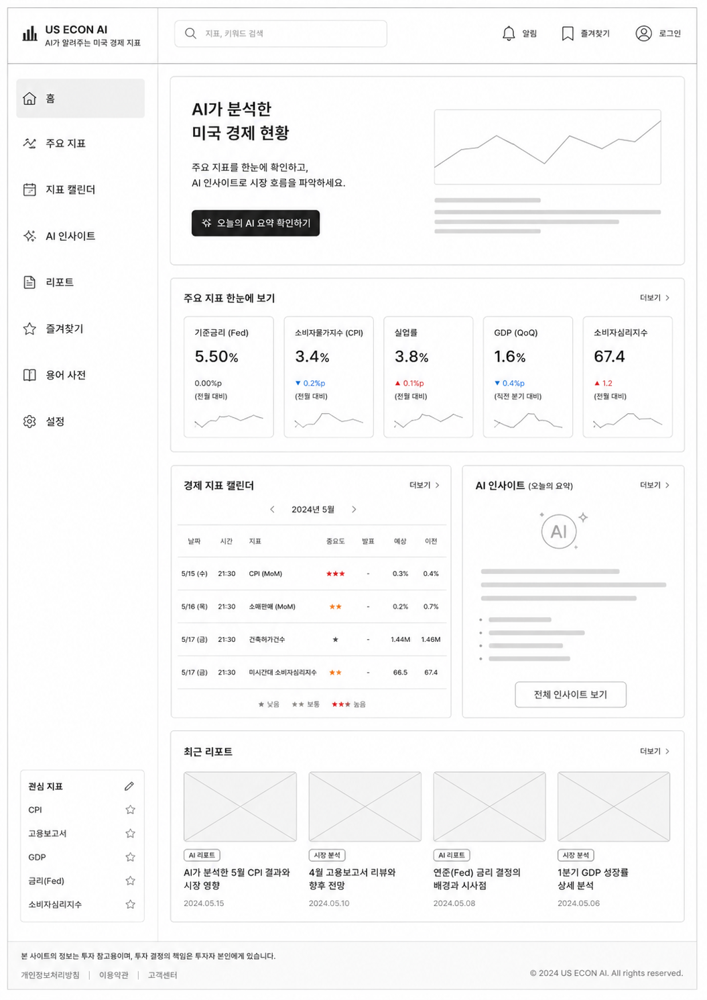

# AI_w15-16

팀원: 고민석, 김규민, 김민철, 김석제, 박민석, 백승진

AI 적용 기술을 활용한 게시판 서비스 과제용 저장소입니다. 현재는 Spring Boot 백엔드와 Ionic React 기반 프론트엔드의 초기 구성을 완료했고, 이후 RAG, MCP, AI Agent 기능을 게시판 서비스에 확장하는 방향으로 개발합니다.

## 프로젝트 개요



- 기본 게시판 서비스에 AI 활용 기능을 결합하는 것을 목표로 합니다.
- 백엔드는 Spring Boot 기반 로그인 화면과 인증 흐름을 먼저 구성했습니다.
- 프론트엔드는 React, TypeScript, Vite, Ionic React, Capacitor 기반으로 모바일 확장 가능한 구조를 준비했습니다.
- 과제 요구사항, 회의 기록, 프론트 설계 및 구현 계획은 별도 문서로 관리합니다.

## 기술 스택

### Backend

- Java 21
- Spring Boot
- Spring Security
- Thymeleaf
- Maven

### Frontend

- React 18
- TypeScript
- Vite
- Ionic React
- Capacitor
- ESLint

## 디렉터리 구조

```text
.
+-- backend/                      # Spring Boot 백엔드
|   +-- src/main/java/             # 애플리케이션, 보안 설정, 페이지 컨트롤러
|   +-- src/main/resources/        # Thymeleaf 템플릿, 정적 CSS, 설정 파일
|   +-- src/test/java/             # 백엔드 기본/로그인 보안 테스트
+-- front/                        # Ionic React + Vite 프론트엔드
|   +-- src/app/                  # Ionic 앱 셸과 라우팅
|   +-- src/pages/                # 초기 홈 화면
|   +-- src/theme/                # Ionic 테마 변수
+-- docs/superpowers/             # 설계 문서와 구현 계획
+-- myself/                       # 팀 회의 및 개인 정리 노트
+-- 과제내용.md                   # 과제 요구사항 정리
+-- README.md
```

## 현재 구현 내용

### Backend

- 커스텀 로그인 페이지(`/login`)를 추가했습니다.
- 로그인 성공 후 홈 화면(`/`)으로 이동합니다.
- Spring Security 기반 인증을 적용했습니다.
- Swagger UI(`/swagger-ui.html`)와 OpenAPI JSON(`/v3/api-docs`)을 추가했습니다.
- 테스트용 계정을 인메모리 사용자로 구성했습니다.
- 로그인, 로그아웃, 인증 접근 흐름을 검증하는 테스트를 추가했습니다.

테스트 계정:

```text
ID: user
PW: password
```

### Frontend

- Vite 기반 React TypeScript 앱을 구성했습니다.
- Ionic React 앱 셸과 라우팅을 추가했습니다.
- `/` 요청은 `/home`으로 리다이렉트됩니다.
- Capacitor 설정을 추가해 추후 Android/iOS 확장이 가능하도록 했습니다.
- lint, build, Capacitor sync/copy 스크립트를 준비했습니다.

### Documentation

- 프론트엔드 설계 문서:
    - `docs/superpowers/specs/2026-06-05-front-ionic-react-capacitor-design.md`
- 프론트엔드 구현 계획:
    - `docs/superpowers/plans/2026-06-05-front-ionic-react-capacitor.md`
- 과제 요구사항과 팀 운영 노트:
    - `과제내용.md`
    - `myself/260605.txt`
    - `myself/팀.md`

## 실행 방법

### Backend

```powershell
cd backend
.\mvnw.cmd spring-boot:run
```

브라우저에서 다음 주소로 접속합니다.

```text
http://localhost:8080
```

Swagger UI는 다음 주소에서 확인합니다.

```text
http://localhost:8080/swagger-ui.html
```

### Frontend

```powershell
cd front
npm install
npm run dev
```

기본 Vite 개발 서버 주소는 다음과 같습니다.

```text
http://localhost:5173
```

## 검증 명령

### Backend

```powershell
cd backend
.\mvnw.cmd test
```

### Frontend

```powershell
cd front
npm run lint
npm run build
```

## 향후 작업 방향

- 게시판 CRUD, 댓글, 태그, 검색, 페이지네이션 구현
- 데이터베이스 연동
- RAG 기반 검색/추천/요약 기능 설계
- MCP 기반 외부 도구 또는 서비스 연동
- AI Agent 기반 자동 처리 흐름 설계
- 백엔드와 프론트엔드 통합
