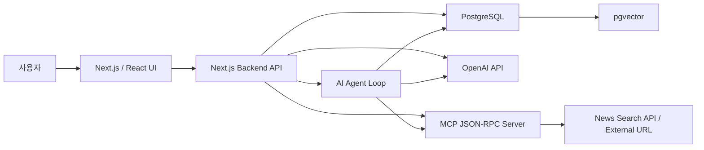

# Baseball AI Board

RAG, MCP, AI Agent를 활용해 경기 리뷰와 야구 이슈 브리핑을 돕는 AI 야구 커뮤니티입니다.

기본 게시판 기능 위에 상용 LLM을 활용한 RAG, MCP, Agent 기능을 결합해 사용자가 더 쉽게 야구 이슈를 정리하고, 관련 게시글과 외부 자료를 찾고, 경기 리뷰 초안을 발전시킬 수 있는 서비스를 목표로 합니다.

## 1. 프로젝트 개요

Baseball AI Board는 야구 팬들이 경기 리뷰, 선수 분석, 팀 전력 평가, 이적/부상 소식, 응원 글을 공유하는 게시판입니다.

사용자가 글을 작성할 때 AI가 기존 야구 게시글을 검색해 유사한 토론을 추천하고, 외부 뉴스나 참고 URL을 브리핑하며, 짧은 아이디어를 경기 리뷰나 분석 글 초안으로 확장할 수 있도록 돕습니다.

## 2. 기술 스택

| 영역 | 선택 기술 | 사용 이유 |
| --- | --- | --- |
| Frontend | React + Next.js | 게시글 목록, 작성, 상세, 검색, AI 브리핑 패널 같은 화면을 React 컴포넌트로 구성하고, 라우팅과 서버 연동을 같은 프레임워크 안에서 처리하기 위해 사용합니다. |
| Backend | Next.js API Routes / Server Actions | 프론트엔드와 가까운 위치에서 게시판 API, 인증 처리, 야구 브리핑과 AI 기능 호출을 구현해 전체 구조를 단순하게 유지하기 위해 사용합니다. |
| Language | TypeScript | 사용자, 게시글, 댓글, 태그, AI 응답처럼 구조가 있는 데이터를 타입으로 관리해 프론트엔드와 백엔드 사이의 실수를 줄이기 위해 사용합니다. |
| Database | PostgreSQL | 사용자, 게시글, 댓글, 팀/선수/주제 태그처럼 관계가 있는 데이터를 안정적으로 저장하고, pgvector 확장까지 함께 사용할 수 있어 선택했습니다. |
| ORM | Prisma | 데이터 모델과 관계를 코드로 명확히 정의하고, 마이그레이션과 쿼리 작성을 일관되게 관리하기 위해 사용합니다. |
| Vector DB | PostgreSQL + pgvector | 별도 벡터 DB를 추가하지 않고 야구 게시글 데이터와 임베딩 벡터를 같은 DB에서 관리해 RAG 인프라를 단순화하기 위해 사용합니다. |
| LLM | OpenAI API | 텍스트 생성, 요약, 임베딩, Function Calling을 하나의 API 생태계에서 사용할 수 있어 RAG와 Agent 기능을 연결하기 쉽습니다. |
| RAG Framework | LangChain.js | 야구 게시글 데이터를 검색 가능한 지식 소스로 연결하고, 임베딩, 검색, 프롬프트 구성, LLM 응답 생성을 하나의 RAG 파이프라인으로 구성하기 위해 사용합니다. |
| MCP | Node.js 기반 JSON-RPC 서버 직접 구현 | LLM이 야구 뉴스 검색이나 외부 URL 분석 같은 외부 도구를 호출할 수 있도록 요청/응답 규격을 분리하고, 도구 서버의 역할을 명확히 보여주기 위해 사용합니다. |
| Agent | Function Calling 기반 직접 구현 | LLM이 상황에 따라 유사 게시글 검색, 야구 뉴스 브리핑, 태그 추천, 경기 리뷰 초안 확장 같은 도구를 선택하고 실행하는 추론 루프를 만들기 위해 사용합니다. |
| Auth | JWT + HttpOnly Cookie | 로그인 상태를 서버에서 안전하게 검증하고, 브라우저 환경에서 토큰 노출 위험을 줄이기 위해 사용합니다. |
| Styling | Tailwind CSS | 별도 UI 프레임워크에 크게 의존하지 않고, 빠르게 일관된 레이아웃과 컴포넌트 스타일을 구성하기 위해 사용합니다. |

## 3. 주요 구현 기능

### 기본 게시판 기능

- 회원가입
- 로그인 / 로그아웃
- 게시글 CRUD
- 댓글 작성 / 삭제
- 태그 등록 / 조회
- 게시글 검색
- 게시글 페이징

### AI 활용 기능

- RAG 기반 유사 야구 게시글 추천 및 요약
- MCP 기반 야구 뉴스/외부 URL 브리핑
- AI Agent 기반 경기 리뷰 작성 도우미

## 4. 전체 아키텍처 구조



## 5. AI 기능 설계

### RAG 기능: 유사 야구 게시글 추천 및 요약

RAG 파이프라인은 LangChain.js를 사용해 구성합니다. 사용자가 경기 리뷰나 선수 분석 글을 작성할 때 제목과 본문을 임베딩으로 변환하고, pgvector에 저장된 기존 야구 게시글 임베딩과 비교해 의미적으로 유사한 게시글을 검색합니다.

검색된 게시글은 LLM에 컨텍스트로 전달되며, LLM은 사용자가 참고할 수 있도록 비슷한 경기 이슈, 선수 평가, 팀 전력 논의의 핵심 내용을 요약합니다.

LangChain.js는 RAG 파이프라인의 기본 흐름을 구성하는 데 사용하고, 게시글/댓글 데이터 소스 연동, pgvector 저장 및 유사도 검색, 야구 게시판 도메인에 맞춘 프롬프트 구성은 프로젝트 내부에서 직접 설계합니다.

```text
경기 리뷰/선수 분석 글 제목과 본문 입력
→ LangChain.js RAG pipeline
→ OpenAI Embedding 생성
→ pgvector 유사도 검색
→ 관련 야구 게시글 3개 조회
→ 검색 결과를 context로 구성
→ LLM 요약
→ 작성 화면에 추천 결과 표시
```

### MCP 기능: 야구 뉴스 및 외부 URL 브리핑

사용자가 팀명, 선수명, 야구 이슈 키워드 또는 참고 URL을 입력하면 Next.js 서버가 별도 MCP 서버에 JSON-RPC 요청을 보냅니다. MCP 서버는 뉴스 검색 API나 외부 URL에서 제목, 링크, 요약 정보를 수집하고, 게시글 작성에 활용할 수 있는 브리핑 형태로 반환합니다.

KBO 공식 경기 데이터 API가 명확히 제공되지 않는 상황을 고려해, 비공식 KBO API에 의존하지 않고 뉴스 검색 API와 사용자가 입력한 URL을 중심으로 외부 데이터 연동을 설계합니다.

```text
팀명/선수명/키워드/URL 입력
→ Next.js API
→ MCP JSON-RPC 요청
→ 야구 뉴스 또는 외부 URL 데이터 수집
→ 제목/링크/요약 반환
→ 게시글 브리핑 카드 생성
```

MCP 서버에서는 API Key와 외부 서비스 접근 권한을 서버 환경 변수로 관리합니다.

### Agent 기능: 경기 리뷰 작성 도우미

AI Agent는 사용자의 짧은 야구 이슈나 경기 메모를 바탕으로 필요한 도구를 선택하고 실행합니다. 단순 LLM 호출이 아니라, Function Calling을 사용해 도구 선택과 실행 결과 반영을 반복하는 구조로 구현합니다.

Agent가 사용할 수 있는 도구 예시는 다음과 같습니다.

- 유사 야구 게시글 검색
- 팀/선수/주제 기반 태그 추천
- 야구 뉴스 및 외부 URL 브리핑
- 경기 리뷰 초안 확장
- 게시글 요약 생성

```text
사용자 경기 메모 입력
→ LLM이 필요한 tool 선택
→ tool 실행
→ 실행 결과를 LLM에 다시 전달
→ 최대 반복 횟수까지 추론
→ 최종 경기 리뷰 초안 반환
```

무한 루프를 방지하기 위해 Agent 실행은 최대 반복 횟수를 제한하고, 도구 실행 실패 시 fallback 응답을 반환하도록 설계합니다.

## 6. 데이터베이스 설계 초안

| 테이블 | 역할 |
| --- | --- |
| users | 사용자 계정 정보 |
| posts | 게시글 정보 |
| comments | 댓글 정보 |
| tags | 팀, 선수, 리그, 이슈 유형 태그 정보 |
| post_tags | 게시글과 태그의 다대다 관계 |
| post_embeddings | 게시글 임베딩 벡터 저장 |
| ai_logs | AI 기능 호출 로그 |
| mcp_requests | MCP 요청/응답 기록 |
| agent_runs | Agent 실행 상태 및 결과 기록 |

## 7. 데모 시나리오

1. 사용자가 회원가입 후 로그인합니다.
2. 게시글 작성 페이지에서 경기 리뷰나 선수 분석 메모를 작성합니다.
3. RAG 기능이 기존 유사 야구 게시글을 추천하고 요약합니다.
4. 사용자가 팀명, 선수명, 야구 이슈 키워드 또는 참고 URL을 입력하면 MCP 서버가 외부 자료를 브리핑합니다.
5. Agent가 경기 리뷰 초안, 팀/선수/주제 태그, 요약을 제안합니다.
6. 사용자가 게시글을 등록하고 다른 사용자가 댓글로 의견을 남깁니다.

## 8. 회고, 한계점, 개선 아이디어

### 예상 한계점

- 상용 LLM API 비용과 응답 속도에 영향을 받을 수 있습니다.
- pgvector 기반 검색 품질은 임베딩 모델과 게시글 데이터 품질에 의존합니다.
- KBO 공식 경기 데이터 API가 명확히 제공되지 않아 실시간 경기 기록보다는 뉴스 검색과 URL 브리핑 중심으로 외부 데이터를 연동합니다.
- MCP 서버의 외부 URL 수집은 사이트 구조나 접근 제한에 따라 실패할 수 있습니다.
- Agent가 잘못된 도구를 선택할 가능성이 있어 실행 제한과 예외 처리가 필요합니다.

### 개선 아이디어

- 사용자별 관심 팀/선수 기반 추천 기능 추가
- 시즌별 팀 이슈와 게시판 반응을 요약하는 야구 트렌드 리포트 생성
- 공식 데이터 제공 범위가 명확한 외부 스포츠 API를 활용한 경기 일정/결과 브리핑 확장
- 관리자용 AI 모더레이션 기능 추가
- LangGraph 기반 Agent 상태 관리 고도화
