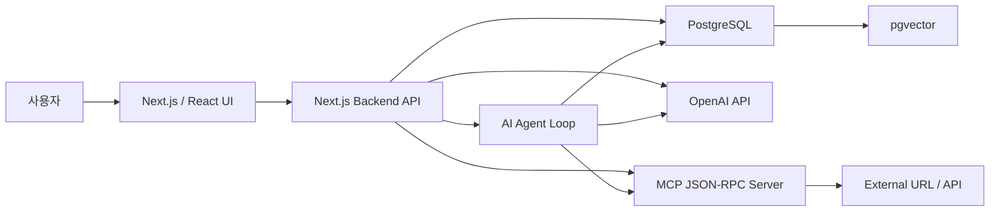

# Jungle AI Board

RAG, MCP, AI Agent를 활용해 글 작성과 지식 검색을 도와주는 AI 지식 공유 게시판입니다.

이 프로젝트는 크래프톤 정글 15-16주차 과제인 **AI 응용 기술을 활용한 게시판 구현**을 위한 개인 프로젝트입니다. 기본 게시판 기능을 직접 구현하고, 상용 LLM을 활용한 RAG, MCP, Agent 기능을 게시판 작성 경험 안에 자연스럽게 연결하는 것을 목표로 합니다.

## 1. 프로젝트 개요

Jungle AI Board는 개발자와 학습자가 질문, 트러블슈팅, 회고, 기술 정리 글을 공유하는 게시판입니다.

사용자가 글을 작성할 때 AI가 기존 게시글을 검색해 유사한 글을 추천하고, 외부 URL 자료를 가져와 요약하며, 짧은 아이디어를 게시글 초안으로 확장할 수 있도록 돕습니다.

## 2. 기술 스택

| 영역 | 선택 기술 | 선택 이유 |
| --- | --- | --- |
| Frontend | React + Next.js | 과제의 React 요구사항을 만족하면서 프론트엔드와 백엔드를 한 프로젝트에서 관리할 수 있습니다. |
| Backend | Next.js API Routes / Server Actions | 개인 과제에서 프로젝트 수를 줄이고, 게시판 API와 AI API 호출을 빠르게 연결할 수 있습니다. |
| Language | TypeScript | 프론트엔드, 백엔드, API 응답 타입을 일관되게 관리할 수 있습니다. |
| Database | PostgreSQL | 게시판의 관계형 데이터 관리에 적합하며, pgvector 확장으로 벡터 검색까지 함께 처리할 수 있습니다. |
| ORM | Prisma | DB 스키마, 관계, 마이그레이션을 명확하게 관리할 수 있고 Next.js와 궁합이 좋습니다. |
| Vector DB | PostgreSQL + pgvector | 게시글 데이터와 임베딩 벡터를 같은 DB에서 관리해 RAG 구조를 단순화할 수 있습니다. |
| LLM | OpenAI API | 상용 LLM, Embedding, Function Calling을 함께 활용하기 쉬워 RAG와 Agent 구현에 적합합니다. |
| RAG | 직접 구현 | 검색, 임베딩, 컨텍스트 구성, LLM 응답 생성 흐름을 직접 설계해 과제 목적에 맞게 설명할 수 있습니다. |
| MCP | Node.js 기반 JSON-RPC 서버 직접 구현 | MCP Server, JSON-RPC 요청/응답, 외부 서비스 연동 구조를 명확하게 보여줄 수 있습니다. |
| Agent | Function Calling 기반 직접 구현 | LLM이 도구를 선택하고 실행하는 추론 루프를 직접 구현할 수 있습니다. |
| Auth | JWT + HttpOnly Cookie | 회원가입/로그인 구조를 직접 구현하고, REST API와 Android 클라이언트 연동 가능성도 남길 수 있습니다. |
| Styling | Tailwind CSS | 빠르게 일관된 UI를 구성할 수 있습니다. |

## 3. 주요 구현 기능

### 기본 게시판 기능

- 회원가입
- 로그인 / 로그아웃
- 게시글 CRUD
- 댓글 작성 / 삭제
- 태그 등록 / 조회
- 게시글 검색
- 게시글 페이징

### AI 활용 기능

- RAG 기반 유사 게시글 추천 및 요약
- MCP 기반 외부 URL 브리핑
- AI Agent 기반 게시글 작성 도우미

## 4. 전체 아키텍처 구조



## 5. AI 기능 설계

### RAG 기능: 유사 게시글 추천 및 요약

사용자가 새 게시글을 작성할 때 제목과 본문을 임베딩으로 변환하고, pgvector에 저장된 기존 게시글 임베딩과 비교해 의미적으로 유사한 게시글을 검색합니다.

검색된 게시글은 LLM에 컨텍스트로 전달되며, LLM은 사용자가 참고할 수 있도록 유사한 이유와 핵심 내용을 요약합니다.

```text
새 글 제목/본문 입력
→ Embedding 생성
→ pgvector 유사도 검색
→ 관련 게시글 3개 조회
→ LLM 요약
→ 작성 화면에 추천 결과 표시
```

### MCP 기능: 외부 URL 브리핑

사용자가 참고 URL을 입력하면 Next.js 서버가 별도 MCP 서버에 JSON-RPC 요청을 보냅니다. MCP 서버는 외부 URL의 메타데이터와 본문 일부를 수집하고, 게시글 작성에 활용할 수 있는 참고 자료 형태로 반환합니다.

```text
URL 입력
→ Next.js API
→ MCP JSON-RPC 요청
→ 외부 URL 데이터 수집
→ 요약/메타데이터 반환
→ 게시글 참고 카드 생성
```

MCP 서버에서는 API Key와 외부 서비스 접근 권한을 서버 환경 변수로 관리합니다.

### Agent 기능: 게시글 작성 도우미

AI Agent는 사용자의 짧은 아이디어를 바탕으로 필요한 도구를 선택하고 실행합니다. 단순 LLM 호출이 아니라, Function Calling을 사용해 도구 선택과 실행 결과 반영을 반복하는 구조로 구현합니다.

Agent가 사용할 수 있는 도구 예시는 다음과 같습니다.

- 유사 게시글 검색
- 태그 추천
- 외부 URL 브리핑
- 게시글 초안 확장
- 게시글 요약 생성

```text
사용자 아이디어 입력
→ LLM이 필요한 tool 선택
→ tool 실행
→ 실행 결과를 LLM에 다시 전달
→ 최대 반복 횟수까지 추론
→ 최종 게시글 초안 반환
```

무한 루프를 방지하기 위해 Agent 실행은 최대 반복 횟수를 제한하고, 도구 실행 실패 시 fallback 응답을 반환하도록 설계합니다.

## 6. 데이터베이스 설계 초안

| 테이블 | 역할 |
| --- | --- |
| users | 사용자 계정 정보 |
| posts | 게시글 정보 |
| comments | 댓글 정보 |
| tags | 태그 정보 |
| post_tags | 게시글과 태그의 다대다 관계 |
| post_embeddings | 게시글 임베딩 벡터 저장 |
| ai_logs | AI 기능 호출 로그 |
| mcp_requests | MCP 요청/응답 기록 |
| agent_runs | Agent 실행 상태 및 결과 기록 |

## 7. 데모 시나리오

1. 사용자가 회원가입 후 로그인합니다.
2. 게시글 작성 페이지에서 질문이나 학습 내용을 작성합니다.
3. RAG 기능이 기존 유사 게시글을 추천하고 요약합니다.
4. 사용자가 참고 URL을 입력하면 MCP 서버가 외부 자료를 브리핑합니다.
5. Agent가 글 초안, 태그, 요약을 제안합니다.
6. 사용자가 게시글을 등록하고 댓글을 작성합니다.

## 8. 회고, 한계점, 개선 아이디어

### 예상 한계점

- 상용 LLM API 비용과 응답 속도에 영향을 받을 수 있습니다.
- pgvector 기반 검색 품질은 임베딩 모델과 데이터 품질에 의존합니다.
- MCP 서버의 외부 URL 수집은 사이트 구조나 접근 제한에 따라 실패할 수 있습니다.
- Agent가 잘못된 도구를 선택할 가능성이 있어 실행 제한과 예외 처리가 필요합니다.

### 개선 아이디어

- 사용자별 관심 태그 기반 추천 기능 추가
- 게시판 히스토리 기반 트렌드 리포트 생성
- Android 앱 클라이언트와 연동 가능한 REST API 확장
- 관리자용 AI 모더레이션 기능 추가
- LangGraph 기반 Agent 상태 관리 고도화
