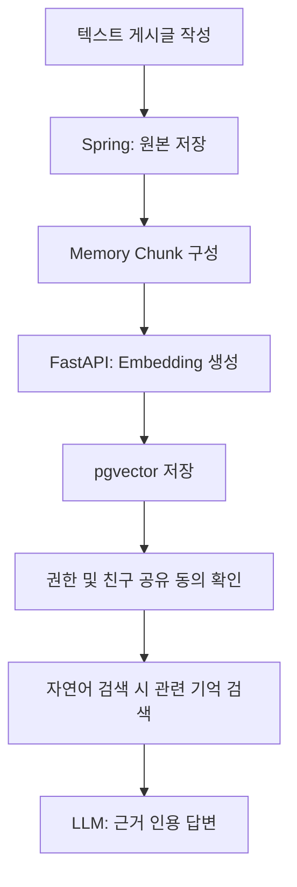

# 💡 Product Ideation — Memento
---

## 1. 제품 가설

사용자가 글과 태그, 댓글로 개인 기록을 남기면, Memento는 단순 저장을 넘어 기록 속 맥락을 추출하고, 누적된 데이터를 AI Agent와 외부 LLM이 MCP로 사용할 수 있는 **개인 컨텍스트 메모리**로 전환한다. 또한 사용자가 동의한 범위 안에서는 승인된 친구가 그 맥락을 조회하고 AI 기능에 활용할 수 있다.

즉, Memento의 핵심 가설은 다음과 같다.

> 사람들은 기록을 남기지만, 시간이 지나면 다시 찾기 어렵다.  
> AI 시대의 개인 기록 서비스는 “저장소”가 아니라, 사용자의 기억을 검색·요약·재사용 가능한 컨텍스트로 바꾸는 시스템이어야 한다.

| 추출 대상 | 내용 |
|----------|------|
| 📝 **콘텐츠** | 게시글 제목/본문, 댓글, 태그, 승인된 친구의 공유 기록 |
| ⏱ **시간/메타** | 작성 시점, 업로드 시점, 사용자 입력 메타데이터 |
| 🤝 **관계 정보** | 친구 관계, 친구 게시글 상호작용, 공유 동의 상태 |
| 🔁 **패턴** | 비슷한 기억, 반복되는 취향, 자주 등장하는 관계와 장소 |
| 🖼 **시각 정보** | 후속 확장에서 다룰 사진 속 장소, 사물, 장면, 분위기 |
| 🔤 **이미지 내 텍스트** | 후속 확장에서 OCR로 읽을 수 있는 이미지 내 텍스트 |

---

## 2. 대상 사용자 가설

**1차 사용자**: AI 도구를 적극적으로 활용하는 **개인 기록 중심 사용자, 개발자, 크리에이터**

| # | 사용자 니즈 (Job-to-be-done) |
|---|------------------------------|
| N1 | 글, 태그, 댓글로 남긴 기록을 나중에 **자연어로 다시 찾고 싶다.** |
| N2 | ChatGPT·Claude 같은 외부 LLM이 **나의 취향과 과거 맥락을 더 잘 이해**했으면 한다. |
| N3 | 친한 사람의 기록 맥락을 허락된 범위에서 이해해 **선물 추천이나 대화 준비처럼 관계 기반 도움**을 받고 싶다. |
| N4 | Notion 같은 외부 지식 도구에 **회고와 기록을 자동으로 정리**하고 싶다. |
| N5 | 복잡한 자동화 도구를 직접 세팅하지 않고, **자연어로 워크플로우를 만들고** 싶다. |

---

## 3. 3C4P 기반 제품 해석

Memento는 단순한 게시판, 사진첩, AI 검색 도구가 아니라 **개인 기억을 AI가 사용할 수 있는 맥락 자산으로 바꾸는 서비스**로 해석할 수 있다. 이를 3C4P 관점에서 정리하면 다음과 같다.

---

### 3.1 3C 분석

| 구분 | 해석 | 제품 시사점 |
|------|------|-------------|
| **Customer** | 사용자는 글, 회고, 프로젝트 기록을 많이 남기지만 시간이 지나면 다시 찾지 못한다. 특히 AI 도구를 자주 쓰는 사용자는 자신의 과거 맥락과 허락된 친구의 맥락이 LLM에 연결되기를 원한다. | 검색 가능한 개인 메모리, 친구 공유 맥락, 자연어 질의, Context Capsule, 외부 LLM 연동이 핵심 가치가 된다. |
| **Company** | Memento는 게시글 CRUD, 친구 관계, 텍스트 RAG, MCP, Agent Workflow를 하나의 제품 경험으로 묶을 수 있다. | 기술 자체보다 “기록 → 공유 동의 → 분석 → 검색 → 재사용” 흐름을 매끄럽게 만드는 것이 중요하다. |
| **Competitor** | 개인 블로그/회고 툴과 일부 SNS가 부분적으로 경쟁한다. 그러나 대부분은 글·태그·친구 공유 맥락·외부 LLM 컨텍스트·Agent 실행을 한 제품 안에서 연결하지 못한다. | 차별점은 “AI가 읽을 수 있는 개인/친구 기억 저장소”와 “MCP 기반 외부 활용성”이다. |

#### 3C 핵심 결론

Memento의 경쟁력은 기록 기능 자체가 아니라, 사용자의 흩어진 기억과 동의된 친구 맥락을 **AI 시대의 관계형 컨텍스트 인프라**로 바꾸는 데 있다.

---

### 3.2 4P 분석

| 구분 | 해석 | 제품 전략 |
|------|------|-----------|
| **Product** | 텍스트 기반 게시글, 댓글, 태그, 친구 관계, 좋아요, 자연어 검색, Context Capsule, Agent Workflow, MCP Server/Client를 제공한다. | MVP는 “텍스트 Memory Post + 친구 공유 + Memory Search + Context Capsule + Notion Export + MCP tool 일부”에 집중하고, 이미지 기능은 후속 확장으로 둔다. |
| **Price** | 초기 사용자는 저장 용량보다 AI 분석·검색·외부 연동 가치에 비용을 지불할 가능성이 높다. | 무료 기본 기록 + 제한된 AI 분석, 유료 플랜에서 고급 검색·Capsule·Agent 실행·외부 연동 제공이 적합하다. |
| **Place** | 사용자는 웹에서 기록을 작성하고, Claude/ChatGPT/Notion 같은 외부 도구에서 기억을 다시 사용한다. | Web App을 기본 접점으로 두고, MCP와 Notion export를 확장 접점으로 설계한다. |
| **Promotion** | “AI 게시판”보다는 “나중에 자연어로 다시 찾는 기억”, “외부 LLM이 이해하는 나만의 컨텍스트”가 더 강한 메시지다. | 개발자·크리에이터·회고 작성자를 대상으로 데모 중심 메시지가 효과적이다. |

#### 4P 핵심 결론

Memento는 기능을 많이 보여주는 제품보다, 사용자가 바로 이해할 수 있는 한 문장 가치가 중요하다.

> “글과 태그로 남긴 기억과 허락된 친구 맥락을, 나중에 AI가 찾아주고 써먹게 해주는 메모리 서비스”

---

## 4. 핵심 경험 가설

### 📝 4.1 Memory Post

일반 게시판처럼 글을 쓰되, 업로드 순간 기억으로 구조화된다.

| 구분 | 기능 |
|------|------|
| **필수** | 회원가입/로그인 · 텍스트 게시물 CRUD · 댓글 · 태그 · 친구 · 좋아요 · 페이징 · 키워드 검색 |
| **차별** | 게시글/댓글/태그 기반 memory chunk 생성 · 친구 공유 동의 기반 Memory Search · 근거 인용 AI 요약 · Context Capsule · Agent/MCP 연동 |

Memory Post는 사용자가 추가 학습 없이 바로 이해할 수 있는 진입점이다.  
사용자는 “게시글을 쓴다”고 느끼지만, 시스템은 내부적으로 이를 검색 가능한 memory object로 변환한다.

---

### 🔍 4.2 Memory Search

자신의 기록을 자연어로 검색한다.

```text
"작년에 카페에서 공부한다고 남긴 기록 찾아줘"
"내가 최근에 자주 쓴 음식 취향 요약해줘"
"팀 프로젝트 관련 기억만 모아서 보여줘"
"여행 회고 중에서 밤 산책 이야기가 있는 기록 찾아줘"
"친구 민수에게 생일선물로 뭘 주면 좋을지 추천해줘"
```

검색 결과는 **세 층위**로 제공한다.

| 층위 | 근거 |
|------|------|
| 일반 검색 | 제목, 본문, 태그, 댓글, 접근 가능한 친구 게시글 |
| 벡터 검색 | 게시글 제목/본문, 댓글, 태그 기반 memory embedding, 공유 동의된 친구 memory embedding |
| AI 답변 | 근거 게시글을 **인용**한 요약 |

Memory Search의 핵심은 단순 유사도 검색이 아니라, 사용자가 “내가 뭘 남겼는지 기억나지 않는 상황”에서도 원하는 기록에 접근하게 만드는 것이다.

---

### 🤝 4.3 Friend Context

서로 친구로 승인된 사용자는 상대방 게시글을 조회하고 댓글과 좋아요를 남길 수 있다. 다만 친구의 기록을 AI 기능에 활용하려면 기록 소유자가 친구 AI 활용 전역 동의를 켜야 한다.

| 구분 | 정책 |
|------|------|
| 친구 관계 | 요청/승인 기반 양방향 관계 |
| 게시글 상호작용 | 승인된 친구 간 조회, 댓글, 좋아요 허용 |
| AI 활용 | 친구 관계 + 기록 소유자의 전역 opt-in이 모두 필요 |
| MVP AI 근거 | 친구 게시글 제목/본문/태그/댓글 |
| 제외 | 좋아요 패턴 기반 추천, 친구별/게시글별 공유 설정 |

Friend Context는 Memento가 단순 개인 기록장을 넘어 관계 기반 도움을 제공하는 지점이다. 예를 들어 사용자는 친구가 공유를 허용한 기록을 근거로 생일선물 추천, 대화 주제 준비, 최근 관심사 요약을 요청할 수 있다.

---

### 📦 4.4 Context Capsule

특정 목적에 맞는 개인 컨텍스트 묶음. 외부 LLM에 전달 가능한 요약 컨텍스트이며, MCP Server를 통해 외부 client가 조회한다.

> `예시` “내 여행 취향” · “내 개발 프로젝트 이력” · “최근 30일 감정과 관심사” · “내가 자주 쓰는 글쓰기 톤”

Context Capsule은 Memento의 3C 관점 차별점이다.  
Notion이나 사진첩은 기록을 저장하지만, Memento는 기록을 외부 AI가 사용할 수 있는 맥락 단위로 재구성한다.

---

### 🤖 4.5 Agent Workflow

서비스 안의 AI Agent가 기록을 바탕으로 선제적 작업을 수행한다.

| 단계 | 워크플로우 |
|------|-----------|
| **MVP** | 주간 회고 생성 · 비슷한 과거 게시물 추천 · 친구 생일선물 추천 · 태그 기반 기록 정리 · Notion 페이지로 회고 내보내기 |
| **확장** | 주제별 기억 컬렉션 · “오늘 다시 볼 기억” 추천 · 글쓰기 패턴 반영 초안 · 친구별 공유 설정 · 댓글 맥락 반영 답변 초안 · 외부 캘린더/문서/태스크 연동 |

Agent Workflow는 사용자가 직접 검색하지 않아도 기록을 재사용하게 만드는 경험이다.  
단, 외부 서비스에 쓰기 작업을 수행할 때는 반드시 사용자 승인을 요구해야 한다.

---

## 5. 기술 가설

### 🧩 5.1 RAG — 기억을 다시 쓸 수 있게 만드는 핵심

**가설**: RAG는 “텍스트 게시글과 댓글, 태그를 나중에 다시 사용할 수 있는 개인 기억”으로 만드는 핵심 기술이다.

**데이터 소스**

- 게시글 제목/본문
- 댓글
- 태그
- 친구 관계와 친구 AI 공유 동의
- 공유 동의된 친구 게시글/댓글
- 후속 확장: 이미지 파일, 이미지 캡션, OCR 텍스트, 이미지 메타데이터

**처리 흐름**


<br></br>

**MVP에서 pgvector를 우선 채택하는 이유**

- Postgres와 함께 운영 가능해 운영 표면을 줄일 수 있다.
- 게시판 데이터와 벡터 데이터를 **같은 트랜잭션 경계** 안에서 다루기 쉽다.
- 팀 프로젝트 규모에서 운영 복잡도가 낮다.
- 추후 검색 고도화가 필요하면 OpenSearch를 **추가**할 수 있다.

---

### 🔗 5.2 MCP — 외부 LLM 생태계와의 인터페이스

Memento는 **서버이자 클라이언트**라는 양방향 역할을 가진다.

**MCP Server**: 외부 LLM이 Memento의 사용자 컨텍스트를 조회하거나 작업을 요청한다.

| Tool | 역할 |
|------|------|
| `search_memories` | 자연어 질의로 사용자의 기억 검색 |
| `get_context_capsule` | 특정 목적의 개인 컨텍스트 요약 조회 |
| `summarize_recent_posts` | 최근 게시글 요약 |
| `create_post_draft` | 사용자 스타일을 반영한 게시글 초안 생성 |
| `create_post` | 승인된 경우 게시글 작성 |

**MCP Client**: Memento가 외부 MCP 서버에 붙어 작업을 수행한다.

> `MVP 대상` **Notion** — 주간 회고를 페이지로 저장 · 특정 태그 게시글 묶음을 DB로 export · Context Capsule을 문서로 아카이브

MCP는 Memento의 4P 중 Place 전략과 연결된다.  
사용자는 Memento 안에서만 기억을 쓰는 것이 아니라, Claude, ChatGPT, Notion 같은 외부 도구에서도 자신의 기억을 호출할 수 있어야 한다.

---

### ⚙️ 5.3 AI Agent — 도구를 선택·실행하는 워크플로우 실행자

AI Agent는 단순 채팅 응답기가 아니라, 서비스 안의 도구를 선택하고 실행하는 실행자다.

**Agent tool**

- 게시글 검색
- 벡터 검색
- 친구 memory 검색
- 게시글 초안 생성
- 태그 추천
- 친구 생일선물 추천
- Notion export
- Context Capsule 생성

**LangGraph 상태**

```text
user_id · goal · conversation_history · retrieved_memories
selected_tools · draft_output · requires_user_approval
error_count · remaining_steps
```

**안전장치**

| 위험 | 안전장치 |
|------|---------|
| 무한 루프/비용 폭증 | 최대 tool 호출 횟수 제한 · 최대 실행 시간 제한 |
| 의도치 않은 외부 쓰기 | 외부 서비스 쓰기 작업 전 **사용자 승인** |
| 반복 실패 | 실패 횟수 기반 중단 |
| 권한 초과 | 민감 컨텍스트는 scope 기반 권한 확인 |
| 추적 불가 | Agent 실행 로그 저장 |

---

## 6. MVP 범위

| 우선순위 | 항목 |
|----------|------|
| 🔴 **P0 기본 기록** | 회원가입/로그인 · 텍스트 게시글 CRUD · 댓글 · 태그 · 페이징 · 키워드 검색 |
| 🟠 **P1 Memory 핵심** | 텍스트 memory chunk · embedding 저장 · pgvector 기반 Memory Search |
| 🟡 **P2 AI 경험/친구 상호작용** | AI 기반 검색 요약 · 근거 게시물 표시 · Context Capsule 생성/조회 · 친구 게시글 조회/댓글/좋아요 |
| 🟢 **P3 Agent/MCP/친구 AI 활용** | Agent Workflow · 친구 공유 데이터 기반 AI 활용 · 사용자 승인 플로우 · MCP Server tool · Notion 우선 MCP Client 연동 |
| ⚪ **Not MVP** | 이미지 첨부 · 이미지 캡션/OCR/자동 태그 후보 · 팔로우/공개 피드 · 친구 추천 · DM · 실시간 채팅 · 멀티모달 검색 최적화 전용 인프라 · 모바일 앱 · 대규모 OpenSearch 운영 |

### MVP 데모 시나리오

1. 사용자가 제목, 본문, 태그를 포함한 텍스트 게시글을 작성한다.
2. 게시글, 댓글, 태그가 memory chunk로 변환된다.
3. memory chunk가 임베딩되어 pgvector에 저장된다.
4. 사용자가 자연어로 과거 기억을 검색한다.
5. AI가 근거 게시글을 인용해 요약 답변을 제공한다.
6. 사용자가 친구를 맺고 서로 게시글을 조회하며 댓글과 좋아요를 남긴다.
7. 친구가 AI 공유 동의를 켠 경우, 사용자가 친구 기록을 근거로 생일선물 추천을 요청한다.
8. 사용자가 검색 결과로 Context Capsule을 생성한다.
9. Agent가 주간 회고 또는 Notion export 작업을 제안한다.
10. 사용자가 승인하면 Notion 페이지로 export된다.
11. 외부 MCP 클라이언트가 허용된 memory tool을 호출한다.

---

## 7. 제품 리스크

| # | 리스크 | 영향 | 완화책 |
|---|--------|:----:|--------|
| R1 | 개인 기록 데이터를 다루므로 프라이버시 설계가 약하면 제품 신뢰가 무너진다 | 🔴 High | scope 기반 권한, 데이터 접근 경계 설계를 MVP 1순위로 |
| R2 | AI 기능이 게시판 기능과 분리돼 보이면 기술 데모처럼 느껴진다 | 🟡 Mid | 작성→분석→검색→재사용을 하나의 플로우로 통합 |
| R3 | MCP Server/Client를 모두 넣으면 범위가 커진다 | 🟡 Mid | MVP에서 tool 수를 제한 (Server 2 / Client 1) |
| R4 | Agent가 허락 없이 외부에 쓰기 작업을 하면 위험하다 | 🔴 High | 쓰기 작업 전 사용자 승인 필수 |
| R5 | 텍스트 RAG 품질이 낮으면 단순 키워드 검색과 차이가 약해진다 | 🟡 Mid | 근거 chunk 표시, 같은 주제 상위 노출, 답변 근거 제한을 최소 품질 기준으로 둔다 |
| R6 | 친구 데이터가 동의 없이 AI에 쓰이면 신뢰가 무너진다 | 🔴 High | 친구 관계와 기록 소유자의 전역 opt-in을 모두 요구하고 근거 출처를 표시한다 |
| R7 | Notion, ChatGPT Memory와 차별점이 약하게 보일 수 있다 | 🟡 Mid | “글 기반 개인/친구 컨텍스트를 MCP로 외부 AI에 연결”하는 포지셔닝을 명확히 한다 |
| R8 | 유료화 포인트가 불명확하면 AI 비용을 감당하기 어렵다 | 🟡 Mid | 고급 검색·Capsule·Agent 실행·외부 연동을 유료 기능 후보로 분리 |

---

## 8. 성공 기준

- [ ] 사용자가 **텍스트 게시글**을 작성할 수 있다.
- [ ] 게시글, 댓글, 태그가 **검색 가능한 memory**로 저장된다.
- [ ] 사용자가 **자연어로 과거 기억**을 찾을 수 있다.
- [ ] AI가 **검색 근거를 인용**해 요약 답변을 제공한다.
- [ ] 사용자가 검색 결과를 바탕으로 **Context Capsule**을 생성할 수 있다.
- [ ] 승인된 친구가 서로의 게시글을 조회하고 댓글과 좋아요를 남길 수 있다.
- [ ] 친구 AI 활용은 친구 관계와 기록 소유자의 전역 opt-in이 모두 있을 때만 동작한다.
- [ ] 사용자가 친구의 공유 기록을 근거로 **생일선물 추천**을 받을 수 있다.
- [ ] Agent가 주간 회고를 생성하고, **사용자 승인 후 Notion에 저장**한다.
- [ ] 외부 MCP 클라이언트가 **허용된 memory tool**을 호출할 수 있다.
- [ ] 사용자가 Memento를 단순 게시판이 아니라 **AI가 활용 가능한 개인 기억 저장소**로 이해한다.

---

## 9. 최종 포지셔닝 문장

Memento는 글, 댓글, 태그로 남긴 개인 기록과 허락된 친구 맥락을 AI가 이해하고 다시 사용할 수 있는 기억으로 바꾸는 서비스다.

사용자는 평소처럼 게시글을 작성하지만, Memento는 그 안의 제목, 본문, 댓글, 태그, 시간, 반복 패턴을 분석해 검색 가능한 개인 메모리로 만든다. 서로 친구로 승인된 사용자는 게시글을 조회하고 댓글과 좋아요로 상호작용할 수 있으며, 기록 소유자가 동의한 경우에만 친구가 그 기록을 AI 기능에 활용할 수 있다. 이후 사용자는 자연어로 과거 기억이나 친구 맥락을 찾고, AI는 근거를 인용해 요약하며, Agent는 회고나 Notion 정리 같은 작업을 사용자의 승인 아래 수행한다.

3C 관점에서 Memento의 기회는 AI 도구를 적극적으로 쓰는 사용자가 자신의 과거 맥락을 외부 LLM에 연결하고 싶어 한다는 점에 있다.  
4P 관점에서 Memento의 핵심 전략은 웹 기반 Memory Post를 진입점으로 삼고, RAG 검색·Context Capsule·MCP 연동·Agent Workflow를 통해 기록의 재사용 가치를 높이는 것이다.

> “Memento는 내가 남긴 글과 허락된 친구 맥락을, 나중에 AI가 찾아주고 써먹게 해주는 메모리 서비스다.”

---
