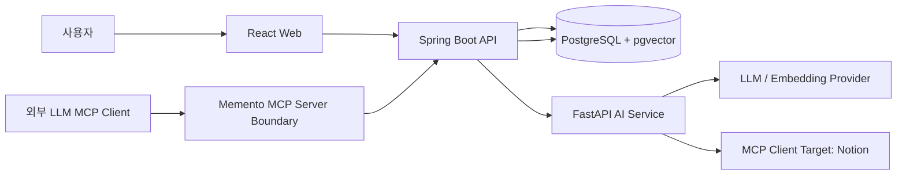
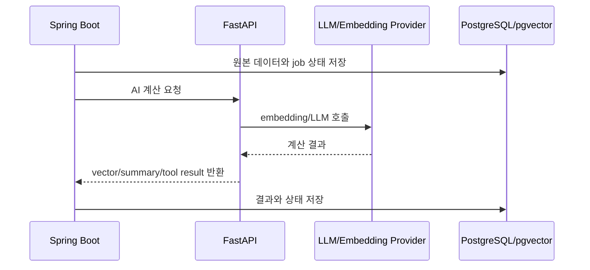
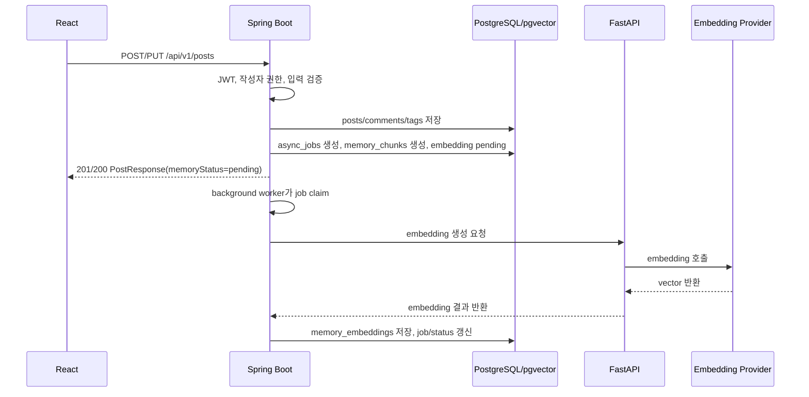
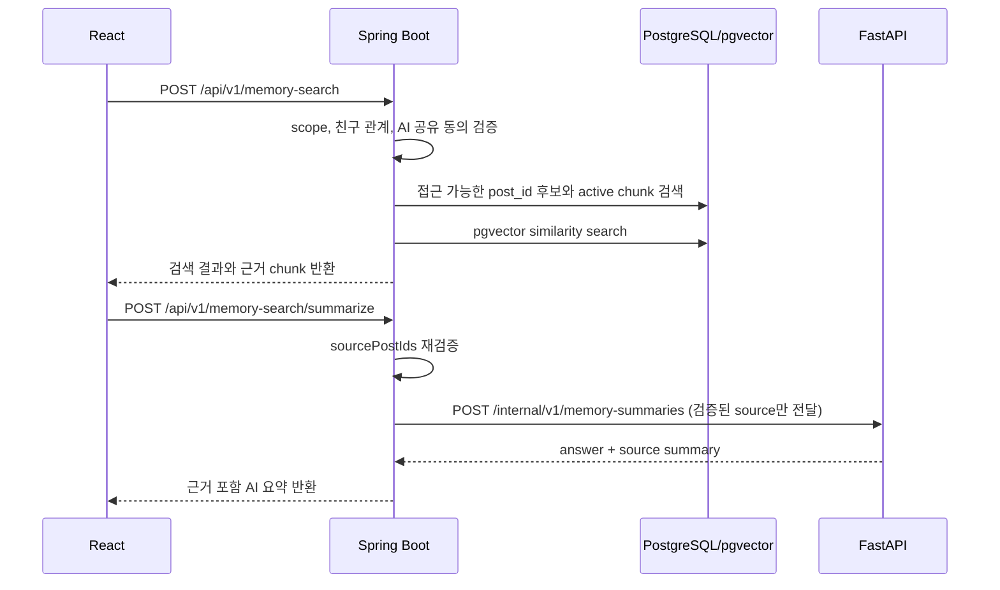
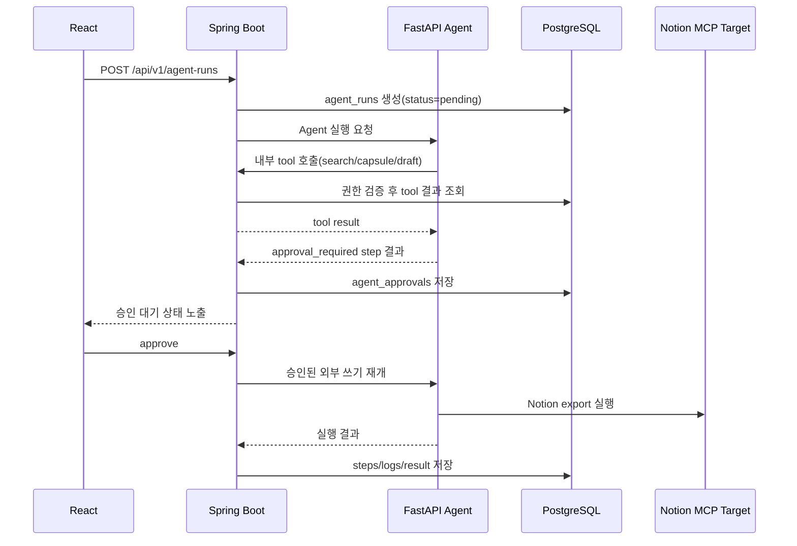

# 아키텍처 문서 초안 — 텍스트 기반 Memory MVP

## 1. 문서 목적

이 문서는 Memento 텍스트 기반 Memory MVP의 구현 아키텍처를 정의한다.

기준 산출물:

- `docs/00-product/PRODUCT_IDEATION.md`
- `docs/00-product/REQUIREMENTS.md`
- `docs/01-design/API_SPEC.md`
- `docs/01-design/ERD.md`
- `docs/04-deployment/DEPLOYMENT.md`
- `docs/04-deployment/DEPLOYMENT.md`

이 문서는 React, Spring Boot, FastAPI, PostgreSQL/pgvector, Agent, MCP의 책임 경계를 고정하고, 구현자가 서비스 간 데이터 흐름과 실패 처리를 같은 기준으로 해석하도록 돕는다.

이번 MVP는 이미지 첨부, 이미지 캡션, OCR, 멀티모달 검색을 제외한다. 게시글 제목, 본문, 댓글, 태그에서 생성한 텍스트 memory를 검색, 요약, Capsule, Agent, MCP 흐름의 근거로 사용한다.

## 2. 아키텍처 결정 요약

| 항목 | 결정 |
|------|------|
| 기본 구조 | React + Spring Boot + FastAPI + PostgreSQL/pgvector로 구성한다. |
| 외부 API 경계 | 클라이언트가 호출하는 공개 REST API는 Spring Boot의 `/api/v1`로 단일화한다. |
| 데이터 소유권 | 사용자, 게시글, 댓글, 태그, 친구, 좋아요, memory 상태, Capsule, Agent/MCP 이력의 최종 저장 책임은 Spring Boot가 가진다. |
| AI 계산 책임 | FastAPI는 embedding 생성, AI 요약, RAG 응답 생성, Agent 실행, LLM/tool orchestration을 담당한다. |
| Memory 처리 주도권 | 게시글 작성/수정 후 Spring Boot가 `async_jobs`, `memory_chunks`, `memory_embeddings` 상태를 만들고 FastAPI에 계산을 위임한다. |
| 권한 검증 | 인증, 데이터 소유권, 친구 관계, 친구 AI 공유 동의, MCP scope 검증은 Spring Boot가 담당한다. |
| vector 검색 | PostgreSQL의 pgvector를 사용한다. 검색 후보는 Spring Boot가 권한 조건으로 제한한다. |
| Agent/MCP | P3 상세 설계 대상으로 포함한다. 다만 MCP wire protocol과 credential 형식/OAuth flow 세부는 후속 MCP 명세에서 확정한다. |
| 외부 쓰기 | Notion export 같은 외부 쓰기 작업은 사용자 승인 완료 전에는 실행하지 않는다. |
| 로그 저장 | Agent/MCP/job 로그에는 원문 prompt, token, secret, 과도한 개인정보를 저장하지 않고 요약/마스킹된 값만 저장한다. |
| 비동기 실행 모델 | 별도 broker 없이 `async_jobs`를 durable queue로 사용하고, Spring Boot worker가 job을 claim한 뒤 FastAPI를 호출한다. |
| 내부 호출 안정성 | Spring Boot와 FastAPI 간 호출에는 `requestId`, `jobId`, idempotency key, timeout, retry 정책을 둔다. |
| MCP 인증 최소 기준 | 외부 MCP client는 앱 JWT를 재사용하지 않고, 사용자별로 발급/폐기 가능한 scoped token 또는 OAuth 계열 credential을 사용한다. |
| Track A 로컬 실행 | Docker Compose로 React, Spring Boot, FastAPI, PostgreSQL/pgvector를 로컬에서 함께 실행한다. |
| Track B AWS 배포 | React는 S3/CloudFront, Spring Boot와 FastAPI는 ECS Fargate, PostgreSQL/pgvector는 RDS를 사용한다. |

### 2.1 Spring Boot 조율을 선택한 이유

embedding 생성과 AI 응답 자체는 FastAPI가 더 적합하지만, Memento의 핵심 위험은 “누가 어떤 memory를 볼 수 있고 AI 근거로 쓸 수 있는가”이다. 따라서 권한, 친구 관계, 공유 동의, 삭제 정책, job 상태를 Spring Boot가 조율한다.

이 구조의 장점:

- 사용자 데이터 소유권과 친구 scope 검증이 한 서비스에 모인다.
- 게시글 CRUD와 memory 파생 데이터 상태를 같은 트랜잭션 경계에서 시작할 수 있다.
- FastAPI가 DB 권한 규칙을 중복 구현하지 않아도 된다.
- API 명세와 ERD의 책임 경계가 일관된다.

감수하는 비용:

- Spring Boot에 AI 작업 orchestration 코드가 생긴다.
- FastAPI가 독립적으로 memory 테이블을 갱신하는 구조보다 AI 파이프라인 실험 속도는 낮을 수 있다.

## 3. 전체 시스템 구조

### 3.1 컴포넌트 책임

| 컴포넌트 | 책임 | 책임지지 않는 것 |
|----------|------|------------------|
| React | 인증 화면, 게시글/댓글/태그/친구 UI, Memory Search UI, Capsule UI, Agent 실행/승인 UI, MCP 연결 상태 화면 | 권한 판정, AI 근거 선택, secret 저장 |
| Spring Boot | REST API, JWT 인증, refresh token rotation, 데이터 소유권 검증, 친구 권한, AI 공유 동의, job 상태, DB 쓰기, FastAPI 호출 조율 | embedding 계산, LLM 응답 생성, 외부 MCP provider별 실행 로직 |
| FastAPI | embedding 생성, RAG 답변 생성, AI 요약, Agent graph 실행, tool orchestration, Notion MCP Client 실행 | 사용자 인증의 최종 판단, 친구 scope 최종 판단, 주요 DB 테이블의 직접 갱신 |
| PostgreSQL | 사용자/게시글/댓글/태그/친구/좋아요/동의/Capsule/Agent/MCP 이력 저장 | LLM 계산 |
| pgvector | `memory_embeddings.embedding` 기반 vector similarity 검색 | 권한 판정 |
| MCP Server Boundary | 외부 LLM client에 허용된 memory/capsule tool 제공 | 인증 우회, 허용되지 않은 친구 데이터 반환 |

## 4. 데이터 소유권과 내부 호출 경계

### 4.1 저장 책임 원칙

Spring Boot는 다음 테이블의 최종 write owner다.

- `users`, `refresh_token_sessions`, `user_privacy_settings`
- `posts`, `comments`, `tags`, `post_tags`, `post_likes`, `friendships`
- `async_jobs`, `memory_chunks`, `memory_embeddings`
- `context_capsules`, `context_capsule_sources`
- `agent_runs`, `agent_steps`, `agent_approvals`, `tool_call_logs`
- `mcp_connections`, `mcp_connection_secrets`, `mcp_call_logs`

FastAPI는 기본적으로 주요 영속 테이블을 직접 갱신하지 않는다. FastAPI는 Spring Boot가 전달한 요청을 계산하고, 결과를 Spring Boot에 반환한다. 장기 실행 Agent처럼 단계별 상태가 필요한 경우에도 FastAPI는 step result 또는 진행 이벤트를 Spring Boot에 전달하고, Spring Boot가 저장한다.

### 4.2 내부 API 방향

내부 요청에는 원문 token, refresh token, 외부 provider secret을 포함하지 않는다. 사용자 식별자는 Spring Boot의 검증 이후 내부 처리에 필요한 최소 식별자만 전달한다.

### 4.3 비동기 job 실행 모델

MVP에서는 Redis, RabbitMQ, SQS 같은 별도 message broker를 필수 구성으로 두지 않는다. 대신 `async_jobs`를 durable queue로 사용한다.

기본 흐름:

1. 사용자 요청을 받은 Spring Boot API가 원본 데이터와 `async_jobs` row를 같은 트랜잭션 안에서 저장한다.
2. Spring Boot background worker가 `pending` job을 claim한다.
3. worker는 job 상태를 `running`으로 바꾸고 FastAPI에 계산을 요청한다.
4. FastAPI는 제한 시간 안에 계산 결과를 반환한다.
5. Spring Boot가 결과를 DB에 저장하고 job을 `succeeded` 또는 `failed`로 전이한다.

claim 규칙:

- 같은 job이 동시에 실행되지 않도록 DB row lock 또는 원자적 상태 전이를 사용한다.
- worker 재시작으로 `running` job이 방치될 수 있으므로 `started_at`, `updated_at` 기준 timeout 복구 정책을 둔다.
- retry는 `retryable=true`인 job에만 수행하고, 재시도 횟수와 마지막 실패 사유를 남긴다.
- 외부 쓰기 작업은 자동 retry하지 않는다. 사용자의 승인과 idempotency key가 확인된 경우에만 재시도한다.

이 방식은 대규모 운영용 queue를 대체하지 않는다. AI 호출량이 늘거나 worker 수평 확장이 필요해지면 SQS 또는 Redis queue를 도입한다.

### 4.4 내부 호출 안정성 계약

Spring Boot와 FastAPI 사이의 모든 내부 API는 다음 값을 포함한다.

| 필드 | 목적 |
|------|------|
| `requestId` | 서비스 간 로그 상관관계 추적 |
| `jobId` | DB job 상태와 FastAPI 계산 요청 연결 |
| `idempotencyKey` | retry 시 중복 side effect 방지 |
| `userContext` | Spring Boot가 검증한 최소 사용자 식별 정보 |
| `scopeSummary` | FastAPI가 권한 판단을 새로 하지 않도록 제한된 근거 범위 전달 |

운영 규칙:

- 내부 호출 timeout은 작업 종류별로 명시한다.
- embedding, summarize 같은 순수 계산은 제한된 횟수로 retry할 수 있다.
- Notion export 같은 외부 쓰기는 승인 ID와 idempotency key를 함께 검증한다.
- FastAPI 오류는 원문 provider 응답을 그대로 저장하지 않고, 사용자에게 노출 가능한 요약 오류로 변환한다.

## 5. 핵심 실행 흐름

### 5.1 게시글 작성/수정과 memory indexing

정책:

- embedding 실패는 게시글 생성/수정을 롤백하지 않는다.
- 실패는 `memoryStatus`, `GET /api/v1/posts/{postId}/memory-status`, `GET /api/v1/jobs/{jobId}`에서 확인한다.
- 게시글 수정으로 chunk 내용이 바뀌면 기존 chunk/embedding은 `stale` 처리 후 새 chunk/embedding을 생성하는 방식을 기본으로 한다.
- 게시글 삭제 시 해당 게시글의 chunk/embedding은 검색 대상에서 제외한다.
- 검색 쿼리는 `memory_chunks.status = active`와 현재 embedding model/provider를 반드시 필터링한다.
- 같은 게시글에 대한 reindex job이 중복 생성되지 않도록 post 단위 pending/running job 중복 방지 정책을 둔다.

### 5.2 Memory Search

검색 범위:

- `scope=me`: 본인 게시글만 후보로 사용한다.
- `scope=friends`: accepted 친구 게시글만 후보로 사용한다.
- `scope=all_accessible`: 본인과 accepted 친구 게시글을 함께 사용한다.

AI 근거 사용:

- 기본 AI 기능은 본인 memory만 사용한다.
- 친구 memory를 AI 근거로 사용하려면 사용자가 친구 맥락을 명시적으로 요청해야 한다.
- 해당 친구와 accepted 관계여야 한다.
- 해당 친구의 `friend_ai_sharing_enabled`가 `true`여야 한다.
- 좋아요 패턴은 MVP AI 근거로 사용하지 않는다.

검색 성능 기준:

- MVP에서는 접근 가능한 `owner_id` 또는 `post_id` 범위를 먼저 좁힌 뒤 vector similarity를 수행한다.
- 친구가 많아져 `post_id IN (...)` 후보가 커지는 경우에는 owner 단위 필터, 최근 기간 제한, top-k 후보 수 제한을 우선 적용한다.
- pgvector 필터링 성능이 병목이 되면 별도 vector store 또는 검색 전용 projection을 검토한다.

### 5.3 Context Capsule

Capsule은 특정 목적에 맞게 memory search 결과와 요약을 묶은 compact context다.

흐름:

1. React가 `POST /api/v1/context-capsules`를 호출한다.
2. Spring Boot가 사용자, scope, sourcePostIds, 친구 동의 조건을 검증한다.
3. Spring Boot가 접근 가능한 chunk와 게시글 근거를 선택한다.
4. FastAPI가 summary, keyFacts, tags 생성을 보조한다.
5. Spring Boot가 `context_capsules`와 `context_capsule_sources`를 저장한다.

정책:

- Capsule 소유자는 생성 요청 사용자다.
- 다른 사용자의 Capsule은 조회할 수 없다.
- 친구 데이터가 포함된 Capsule은 `contains_friend_context=true`로 저장한다.
- 친구 AI 공유 동의가 철회된 뒤 기존 Capsule을 어떻게 재조회/재생성할지는 구현 전 최종 확인이 필요하다. 기본 방향은 새 AI 응답 근거에서 제외하는 것이다.

### 5.4 Agent Workflow

Agent는 사용자 목표를 받아 내부 tool과 외부 MCP Client tool을 조합해 작업을 수행한다.

Agent 상태:

- `pending`: 실행 요청 접수
- `running`: 실행 중
- `approval_required`: 외부 쓰기 또는 게시글 생성 같은 부작용 작업 승인 대기
- `succeeded`: 정상 완료
- `failed`: 실패
- `rejected`: 사용자가 승인 요청 거절

Agent tool 기본 catalog:

| Tool | 실행 위치 | 설명 |
|------|-----------|------|
| `search_posts` | Spring Boot | 키워드/범위 기반 게시글 검색 |
| `search_memories` | Spring Boot + pgvector | 본인 memory vector 검색 |
| `search_friend_memories` | Spring Boot + pgvector | 친구 관계와 AI 공유 동의 기반 친구 memory 검색 |
| `summarize_memories` | FastAPI | 검색 근거 기반 요약 |
| `create_context_capsule` | Spring Boot + FastAPI | Capsule 생성 |
| `create_post_draft` | FastAPI | 게시글 초안 생성 |
| `request_external_write_approval` | Spring Boot | 외부 쓰기 승인 요청 생성 |
| `notion_export` | FastAPI MCP Client | 승인 후 Notion에 결과 저장 |

Agent 안전장치:

- Agent는 허용된 `allowedTools` 안에서만 tool을 사용할 수 있다.
- tool 호출마다 실행 사용자와 scope를 기록한다.
- 외부 쓰기, 게시글 생성, Notion export는 승인 전 실행하지 않는다.
- 최대 step 수, 최대 실행 시간, 실패 횟수 제한을 둔다.
- 로그에는 원문 prompt와 민감정보를 저장하지 않는다.
- 승인 요청에는 실행할 action, 대상 외부 서비스, 생성/수정될 리소스 요약, 만료 시각을 포함한다.
- 승인 이후 재개할 때도 원래 승인된 action과 현재 실행 action이 일치하는지 검증한다.

### 5.5 MCP Server

MCP Server는 외부 LLM client가 Memento memory를 허용된 scope 안에서 사용할 수 있게 하는 경계다. MVP에서는 Spring Boot 권한 경계를 거쳐 tool을 실행한다.

MCP Server tools:

| Tool | 입력 | 출력 | 권한 |
|------|------|------|------|
| `search_memories` | `query`, `limit` | memory 검색 결과와 source | 본인 memory |
| `search_friend_memories` | `friendId`, `query`, `limit` | 친구 memory 검색 결과와 source | accepted 친구 + 친구 AI 공유 동의 |
| `get_context_capsule` | `capsuleId` | compact context | Capsule 소유자 |
| `summarize_recent_posts` | `days`, `limit` | 최근 게시글 요약 | 본인 게시글 |

MCP Server 공통 규칙:

- 모든 호출은 어떤 사용자 컨텍스트로 실행되는지 식별되어야 한다.
- 외부 MCP client 인증은 앱의 access token을 그대로 재사용하지 않는다.
- MCP credential은 사용자와 scope에 묶어 발급하고, 원문은 한 번만 보여주며 서버에는 hash 또는 secret reference만 저장한다.
- MCP credential은 만료, 폐기, scope 축소가 가능해야 한다.
- scope 검증은 Spring Boot의 기존 권한 정책을 재사용한다.
- 친구 데이터가 포함되면 `ownerUserId`, `ownerNickname`, `postId`, `title`, `sourceType`을 포함해 출처를 구조화한다.
- 허용되지 않은 리소스는 존재 여부를 숨기기 위해 `404` 또는 MCP 대응 오류로 처리한다.
- 호출 이력은 `mcp_call_logs`에 요약/마스킹 형태로 저장한다.

### 5.6 MCP Client와 Notion export

MVP MCP Client의 1차 대상은 Notion export다.

흐름:

1. Agent가 회고, Capsule, 검색 결과를 Notion에 저장할 필요가 있다고 판단한다.
2. Spring Boot가 `agent_approvals`에 `notion_export` 승인 요청을 생성한다.
3. React가 승인 대기 UI를 표시한다.
4. 사용자가 승인하면 Spring Boot가 FastAPI에 승인 완료 이벤트를 전달한다.
5. FastAPI가 Notion MCP Client tool을 실행한다.
6. 결과 또는 실패는 Spring Boot가 `agent_steps`, `tool_call_logs`, `mcp_call_logs`에 저장한다.

secret 정책:

- Notion token 등 외부 secret은 API 응답, job payload, Agent/MCP 로그에 원문으로 저장하지 않는다.
- 운영 환경에서는 외부 secret manager 사용을 우선한다.
- 로컬/MVP 보조 저장이 필요하면 `mcp_connection_secrets`에 AES-256-GCM envelope encryption 결과만 저장한다.

## 6. 보안과 권한 경계

### 6.1 인증

- 보호 API는 JWT Bearer access token을 사용한다.
- refresh token은 HttpOnly, Secure, SameSite=Lax 쿠키로 관리한다.
- refresh token 원문은 저장하지 않고 HMAC-SHA-256 hash만 저장한다.
- refresh token rotation과 reuse 탐지는 `refresh_token_sessions`의 session family로 처리한다.

### 6.2 데이터 접근 원칙

- 비로그인 사용자는 회원가입과 로그인만 가능하다.
- 로그인 사용자는 본인 데이터만 기본 조회한다.
- 친구 게시글 조회는 accepted friendship에서만 가능하다.
- 친구 게시글을 볼 수 있어도 AI 근거 사용은 별도 동의가 필요하다.
- 친구가 아닌 사용자의 데이터는 목록, 검색, 상세, AI 요약, Capsule, MCP 응답에 포함되지 않는다.

### 6.3 AI 근거와 출처

AI 응답은 가능한 한 근거 게시글과 chunk 출처를 함께 반환한다. 친구 데이터가 근거로 쓰인 경우 출처 사용자를 명시한다.

금지:

- 친구 AI 공유 동의 없이 친구 memory를 AI 근거로 사용
- 좋아요 패턴 기반 추론
- 근거 없는 민감한 사적 추론
- 삭제되었거나 `stale/deleted` 상태인 chunk 사용

### 6.4 외부 LLM provider로 나가는 데이터

Memento의 memory는 개인 기록이므로 LLM provider 호출은 외부 데이터 반출 경계로 취급한다.

원칙:

- FastAPI에는 Spring Boot가 권한 검증을 끝낸 최소 chunk와 source metadata만 전달한다.
- LLM provider에 보내는 prompt에는 refresh token, 이메일 원문, 외부 secret, 내부 식별자를 포함하지 않는다.
- provider별 data retention, training opt-out, region, 약관은 운영 베타 전 검토한다.
- 사용자가 삭제/파기한 게시글과 `stale/deleted` chunk는 새 LLM 요청에 포함하지 않는다.
- 운영 로그에는 provider 요청/응답 원문을 저장하지 않는다.

## 7. 실패 처리와 상태 노출

| 실패 지점 | 사용자 영향 | 처리 |
|-----------|-------------|------|
| 게시글 저장 실패 | 게시글 생성/수정 실패 | API 에러 반환 |
| memory chunk 생성 실패 | 게시글은 유지, memoryStatus failed | job/error 상태 저장 |
| embedding provider 실패 | 검색 품질 저하 또는 해당 게시글 검색 제외 | retryable 여부 저장, 수동 reindex 지원 |
| AI 요약 timeout | 검색 결과는 유지, 요약만 지연 | 15초 내 미완료 시 `202 Accepted`와 job 반환 |
| Spring worker 중단 | pending/running job 지연 | timeout 감지 후 재시도 또는 failed 전이 |
| FastAPI 내부 호출 timeout | AI 결과 지연 | retryable job만 제한 재시도 |
| 친구 권한 불충족 | 친구 데이터 조회/AI 사용 차단 | `403` 또는 존재 숨김 `404` |
| Notion export 실패 | Agent run 실패 또는 부분 실패 | step/log에 실패 기록, secret 노출 금지 |
| MCP tool 권한 실패 | tool 실패 | scope 오류로 응답, 호출 이력 저장 |

## 8. 관측성과 로그

저장할 것:

- API request id 또는 correlation id
- `async_jobs` 상태 변화
- Agent step 상태, tool 이름, 요약된 입출력
- MCP call 방향, tool 이름, 상태, 요약된 오류
- provider latency, timeout, retry 가능 여부
- 내부 사용자 ID 또는 hash 처리된 사용자 식별자

저장하지 않을 것:

- refresh token 원문
- 외부 provider access token/API key
- LLM prompt 원문 전체
- 사용자의 게시글/댓글 원문을 중복 복사한 로그
- 마스킹되지 않은 이메일, secret, 민감 payload
- 외부 LLM provider 요청/응답 원문 전체

## 9. 배포와 로컬 실행 기준

Track A 로컬 Docker 기준 서비스:

- React: `http://localhost:5173`
- Spring Boot: `http://localhost:8080`
- FastAPI: `http://localhost:8000`
- PostgreSQL + pgvector: Docker Compose 기반

환경 변수는 `.env.example`을 기준으로 하되, secret은 실제 값이 문서나 git에 남지 않도록 한다.

health check:

- Spring Boot: `GET /api/health`
- FastAPI: `GET /health`
- React: Vite dev server 응답 확인

Track A smoke check:

- Docker Compose로 frontend, backend, ai-server, postgres를 함께 실행한다.
- 회원가입, 로그인, 게시글 작성, memory 상태 조회, Memory Search, AI 요약이 로컬에서 성공한다.
- mock AI provider와 real provider 전환 방식을 확인한다.

Track B AWS MVP 데모 기준 서비스:

- React: S3 static hosting + CloudFront + ACM HTTPS
- Spring Boot: ECS Fargate service behind ALB
- FastAPI: ECS Fargate service, Spring Boot가 내부 호출
- PostgreSQL + pgvector: RDS PostgreSQL, private subnet, storage encryption, automated backup
- Container image: ECR
- Secret: AWS Secrets Manager + KMS
- Logs/metrics: CloudWatch Logs와 ECS/ALB/RDS 기본 metrics

Track B AWS 배포 smoke check:

- CloudFront frontend URL 접속
- API domain의 `GET /api/health` 확인
- FastAPI `GET /health`는 public internet에 노출하지 않고 ECS target group, 내부 DNS, 또는 Spring Boot의 내부 dependency check로 확인
- 회원가입, 로그인, 게시글 작성, memory 상태 조회, Memory Search, AI 요약 확인
- ECS service 재배포 후 RDS 데이터 유지 확인
- 직전 ECS task definition 또는 직전 frontend build artifact로 수동 롤백 가능성 확인

## 10. 대안 검토

### 10.1 FastAPI가 memory/embedding 테이블을 직접 갱신하는 대안

장점:

- AI 파이프라인 코드가 FastAPI에 응집된다.
- LangChain/LangGraph 실험과 schema 변경이 빠르다.

채택하지 않은 이유:

- 친구 권한, AI 공유 동의, 삭제 정책이 FastAPI에 중복될 위험이 크다.
- 주요 DB write owner가 나뉘면 장애 시 상태 복구 기준이 흐려진다.
- API/ERD 문서에서 Spring Boot가 맡는 소유권 경계와 충돌한다.

### 10.2 vector DB를 별도 운영하는 대안

장점:

- 대규모 vector 검색 성능 확장성이 높다.
- 검색 전용 튜닝 선택지가 많다.

채택하지 않은 이유:

- MVP 규모에서는 운영 복잡도가 더 큰 비용이다.
- 게시글/친구 권한과 embedding을 PostgreSQL 트랜잭션 경계 가까이에 두는 편이 단순하다.
- 추후 검색 규모가 커질 때 OpenSearch 또는 별도 vector DB를 추가 검토한다.

### 10.3 SQS/Redis queue를 먼저 도입하는 대안

장점:

- worker 수평 확장과 retry, dead letter queue 운영이 더 명확하다.
- AI 작업량이 많아져도 API request path와 worker path를 더 안정적으로 분리할 수 있다.

채택하지 않은 이유:

- MVP 데모 범위에서는 운영 컴포넌트가 늘어나는 비용이 더 크다.
- `async_jobs` 테이블이 이미 상태 추적과 사용자 조회 API를 담당하므로, 초기에는 durable DB queue로 충분하다.
- job 처리량 또는 retry 복잡도가 커지는 시점에 SQS/Redis를 도입한다.

## 11. 구현 전 확인 필요 항목

아키텍처 초안에서 기본 방향은 정했지만, 구현 직전 아래 항목은 확정해야 한다.

1. 실제 embedding provider/model과 `memory_embeddings.embedding` 차원.
2. pgvector index를 `hnsw`로 시작할지 `ivfflat`로 시작할지.
3. 게시글 수정 시 기존 chunk/embedding을 `stale`로 보존하는 기간.
4. 친구 AI 공유 동의 철회 후 기존 Capsule/Agent 결과 조회 정책.
5. Agent 최대 step 수, 최대 실행 시간, retry 횟수.
6. Agent/MCP/job 로그 보존 기간과 마스킹 필드 목록.
7. MCP Server credential 형식, 발급/폐기 API, OAuth flow 채택 여부.
8. Notion provider config schema와 secret manager 사용 방식.
9. Spring worker의 동시성, timeout, retry 횟수, stuck job 복구 주기.
10. OpenAPI YAML과 내부 Spring-FastAPI API 스키마 작성 순서.

## 12. 검증 시나리오

- 회원가입, 로그인, 토큰 재발급, 로그아웃이 동작하고 보호 API가 `401`을 반환한다.
- 사용자가 게시글을 작성하면 게시글 응답은 성공하고 memory 상태는 `pending`에서 `succeeded` 또는 `failed`로 전이된다.
- embedding 실패가 게시글 CRUD를 롤백하지 않는다.
- 본인 게시글은 `scope=me` 검색과 Memory Search 결과에 포함된다.
- accepted 친구 게시글은 조회 가능하지만, 친구 AI 공유 동의가 꺼져 있으면 AI 검색/요약/Capsule/Agent 근거로 사용되지 않는다.
- 친구 AI 공유 동의가 켜져 있고 사용자가 친구 맥락을 명시하면 친구 memory 검색 결과에 출처가 포함된다.
- AI 요약 timeout 시 검색 결과는 유지되고 job 조회로 후속 결과를 확인할 수 있다.
- worker 재시작 후 `running` 상태로 남은 job이 timeout 정책에 따라 복구된다.
- 같은 게시글에 대해 중복 reindex 요청이 들어와도 최종 active embedding은 하나의 최신 상태로 수렴한다.
- Capsule은 소유자만 조회할 수 있고, 친구 출처가 있으면 `contains_friend_context=true`가 된다.
- Agent는 승인 전 Notion export를 실행하지 않는다.
- 사용자가 승인하면 Notion export가 실행되고 Agent step/log에 결과가 남는다.
- 승인된 Notion export를 retry해도 idempotency key로 중복 페이지 생성을 방지한다.
- MCP Server tool은 허용된 사용자 context와 scope에서만 memory를 반환한다.
- MCP credential 폐기 후 같은 credential로 tool을 호출하면 실패한다.
- 로그와 job payload에 token, secret, 원문 prompt가 저장되지 않는다.

## 13. 후속 산출물

- MCP 설계 문서: MCP 인증, scope 모델, tool schema, wire protocol, provider별 config를 확정한다.
- 내부 API 명세: Spring Boot와 FastAPI 간 embedding, summarize, agent, export 요청/응답 스키마를 정의한다.
- 마이그레이션 초안: ERD를 PostgreSQL DDL, pgvector extension, partial index, check constraint로 변환한다.
- 화면 흐름도: 게시글, 친구, Memory Search, Capsule, Agent 승인, MCP 관리 UI를 연결한다.
- OpenAPI YAML: `docs/01-design/API_SPEC.md` 검토 이후 생성한다.
- 로컬 Docker 실행 체크리스트: `docs/04-deployment/DEPLOYMENT.md`를 기반으로 compose service, env, health check를 구현한다.
- AWS 배포 체크리스트: `docs/04-deployment/DEPLOYMENT.md`를 기반으로 실제 도메인, secret name, ECR repository, ECS service 이름을 채운다.
- ERD 동기화: `docs/01-design/ERD.md`의 구현 전 확인 항목 중 Spring/FastAPI write owner는 이 문서 기준으로 Spring Boot로 확정한다.
