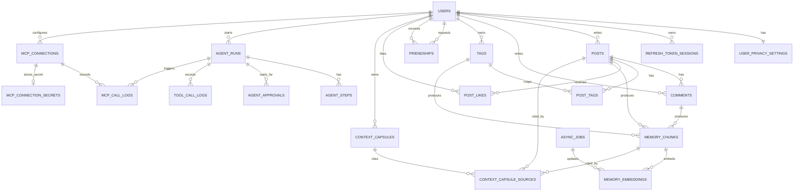

# ERD 초안 — 텍스트 기반 Memory MVP

## 1. 문서 목적

이 문서는 Memento MVP의 데이터 모델 초안을 정의한다.

기준 산출물:

- `docs/REQUIREMENTS_MVP_TEXT_MEMORY.md`
- `docs/API_SPEC_MVP_TEXT_MEMORY.md`

ERD는 PostgreSQL과 pgvector를 전제로 한다. 모든 주요 리소스 ID는 UUID를 사용하고, 시간 컬럼은 UTC 기준 `timestamptz`를 사용한다.

## 2. 구현 우선순위와 문서 범위

요구사항 우선순위에 맞춰 ERD도 다음처럼 해석한다.

| 구분 | 범위 | ERD 상세도 |
|------|------|------------|
| P0/P1 필수 | 인증, 게시글, 댓글, 태그, 친구, 좋아요, MemoryChunk, MemoryEmbedding, 비동기 작업 | 구현 직전 DDL 초안으로 사용 가능해야 한다. |
| P2 확장 | AI 요약, Context Capsule, 친구 AI 공유 동의 | MVP 후반 구현을 고려해 테이블과 권한 경계를 정의한다. |
| P3 초안 | Agent Workflow, MCP Server/Client, 외부 secret | 책임 경계와 저장 원칙만 고정한다. 세부 wire protocol은 별도 설계 문서에서 확정한다. |

이 문서는 테이블 구조, 핵심 제약, 인덱스, 삭제/파기/보안 저장 방식을 다룬다. API 요청/응답 JSON, 화면 흐름, 서비스 간 호출 방식은 각 후속 산출물에서 확정한다.

## 3. 설계 결정 요약

| 항목 | 결정 |
|------|------|
| 삭제 정책 | 일반 사용자 삭제는 `deleted_at` 기반 소프트 삭제를 기본으로 한다. 회원탈퇴/개인정보 파기 요청은 사용자 생성 콘텐츠를 하드 삭제하고, 감사상 필요한 최소 메타데이터만 비식별화해 남긴다. |
| 사용자 이메일 | 이메일 원문은 저장하지 않는다. 복호화가 필요한 본인 조회용 값은 AES-256-GCM 암호문으로, 로그인/중복 확인은 HMAC-SHA-256 조회 hash로 분리한다. |
| 비밀번호 | 비밀번호는 암호화하지 않고 Argon2id 단방향 hash로 저장한다. salt와 파라미터는 encoded hash 문자열에 포함한다. |
| 인증 세션 | refresh token 원문은 저장하지 않고 HMAC-SHA-256 hash만 저장한다. rotation/reuse 탐지를 위해 session family와 revoke reason을 남긴다. |
| 친구 AI 공유 동의 | MVP에서는 사용자 단위 전역 설정 `user_privacy_settings.friend_ai_sharing_enabled`로 시작한다. 친구별/게시글별 동의는 후속 확장이다. |
| MemoryChunk 원본 참조 | 권한 검증 기준은 항상 `post_id`다. 댓글/태그 기반 chunk도 특정 게시글 맥락에서 생성하므로 `comment_id`, `tag_id`는 선택 FK로 둔다. |
| embedding 원본 본문 | 게시글/댓글/MemoryChunk 본문은 MVP에서 필드 암호화하지 않는다. 검색, pgvector, RAG 근거로 사용해야 하므로 접근 제어, 저장소 암호화, 파기 정책으로 보호한다. |
| 비동기 작업 | 공통 `async_jobs` 테이블로 reindex, AI 요약 timeout, 선물 추천 timeout, Agent task 상태를 추적한다. |
| Agent/MCP | P3 초안으로 유지한다. 로그에는 원문 입출력을 저장하지 않고 요약/마스킹된 최소 정보만 저장한다. |

## 4. 전체 ERD

## 5. P0/P1 핵심 테이블

### 5.1 users

| 컬럼 | 타입 | 제약 | 설명 |
|------|------|------|------|
| id | uuid | PK | 사용자 ID |
| email_ciphertext | bytea | NOT NULL | 이메일 암호문. AES-256-GCM 결과이며 auth tag를 포함한다. |
| email_nonce | bytea | NOT NULL | 이메일 암호화에 사용한 nonce |
| email_key_id | varchar(100) | NOT NULL | 이메일 암호화 키 식별자 |
| email_lookup_hash | bytea | NOT NULL | 정규화 이메일의 HMAC-SHA-256 hash. 로그인/중복 확인용 |
| password_hash | text | NOT NULL | Argon2id encoded hash |
| nickname | varchar(50) | NOT NULL | 표시 이름 |
| status | varchar(20) | NOT NULL | `active`, `withdrawn`, `suspended` |
| created_at | timestamptz | NOT NULL | 생성 시각 |
| updated_at | timestamptz | NOT NULL | 수정 시각 |
| withdrawn_at | timestamptz | NULL | 회원탈퇴 시각 |

제약/인덱스:

- `uq_users_email_lookup_hash_active`: `email_lookup_hash` unique where `status = 'active'`
- `idx_users_status_created_at`: `status`, `created_at DESC`

규칙:

- 이메일 정규화는 MVP에서 `trim` + lowercase로 시작한다. 국제화 이메일까지 지원할 경우 정규화 정책을 별도 확장한다.
- API의 본인 정보 응답에 포함되는 `email`은 `email_ciphertext`를 복호화해 만든다.
- 회원탈퇴 후 이메일 재가입을 허용하기 위해 unique 제약은 active 사용자에만 적용한다.

### 5.2 refresh_token_sessions

| 컬럼 | 타입 | 제약 | 설명 |
|------|------|------|------|
| id | uuid | PK | 세션 ID |
| user_id | uuid | FK users.id, NOT NULL | 세션 소유자 |
| session_family_id | uuid | NOT NULL | refresh token rotation 계열 ID |
| token_hash | bytea | UNIQUE, NOT NULL | refresh token의 HMAC-SHA-256 hash |
| rotated_from_hash | bytea | NULL | 직전 token hash. reuse 탐지 보조값 |
| user_agent | text | NULL | 클라이언트 정보 요약 |
| ip_address | inet | NULL | 로그인/재발급 IP |
| expires_at | timestamptz | NOT NULL | 만료 시각 |
| last_used_at | timestamptz | NULL | 마지막 재발급 사용 시각 |
| revoked_at | timestamptz | NULL | 로그아웃/강제 만료 시각 |
| revoked_reason | varchar(50) | NULL | `logout`, `rotation_reuse`, `withdrawal`, `admin`, `expired` |
| created_at | timestamptz | NOT NULL | 생성 시각 |
| rotated_at | timestamptz | NULL | 마지막 rotation 시각 |

제약/인덱스:

- `idx_refresh_sessions_user_active`: `user_id`, `revoked_at`, `expires_at`
- `idx_refresh_sessions_family`: `session_family_id`, `created_at`
- `uq_refresh_sessions_token_hash`: `token_hash` unique

규칙:

- refresh token 재사용이 탐지되면 같은 `session_family_id`의 활성 세션을 모두 폐기한다.
- token 원문은 DB, 로그, 에러, job payload에 저장하지 않는다.

### 5.3 user_privacy_settings

| 컬럼 | 타입 | 제약 | 설명 |
|------|------|------|------|
| user_id | uuid | PK, FK users.id | 사용자 ID |
| friend_ai_sharing_enabled | boolean | NOT NULL DEFAULT false | 친구가 AI 기능에서 내 게시글/댓글을 근거로 쓰도록 허용 |
| updated_at | timestamptz | NOT NULL | 수정 시각 |

규칙:

- 친구 게시글 조회 권한과 AI 근거 사용 권한은 분리한다.
- 이 값이 `false`이면 친구가 게시글을 볼 수 있어도 Memory Search, AI 요약, Capsule, Agent/MCP 근거로 사용할 수 없다.

### 5.4 posts

| 컬럼 | 타입 | 제약 | 설명 |
|------|------|------|------|
| id | uuid | PK | 게시글 ID |
| author_id | uuid | FK users.id, NOT NULL | 작성자 |
| title | varchar(200) | NOT NULL | 제목 |
| content | text | NOT NULL | 본문 |
| memory_status | varchar(20) | NOT NULL | `pending`, `running`, `succeeded`, `failed` |
| created_at | timestamptz | NOT NULL | 생성 시각 |
| updated_at | timestamptz | NOT NULL | 수정 시각 |
| deleted_at | timestamptz | NULL | 일반 삭제 시각 |

제약/인덱스:

- `idx_posts_author_active_created`: `author_id`, `created_at DESC` where `deleted_at IS NULL`
- `idx_posts_active_created`: `created_at DESC` where `deleted_at IS NULL`
- `idx_posts_text_search`: 제목/본문 검색용 GIN 인덱스. 구현 시 `tsvector` generated column을 둘 수 있다.

규칙:

- 친구에게 노출되는 게시글도 작성자 수정/삭제 권한은 열지 않는다.
- 게시글 삭제 시 관련 MemoryChunk는 검색 대상에서 제거한다.

### 5.5 comments

| 컬럼 | 타입 | 제약 | 설명 |
|------|------|------|------|
| id | uuid | PK | 댓글 ID |
| post_id | uuid | FK posts.id, NOT NULL | 대상 게시글 |
| author_id | uuid | FK users.id, NOT NULL | 댓글 작성자 |
| content | text | NOT NULL | 댓글 본문 |
| created_at | timestamptz | NOT NULL | 생성 시각 |
| updated_at | timestamptz | NOT NULL | 수정 시각 |
| deleted_at | timestamptz | NULL | 일반 삭제 시각 |

제약/인덱스:

- `idx_comments_post_active_created`: `post_id`, `created_at ASC` where `deleted_at IS NULL`
- `idx_comments_author_active_created`: `author_id`, `created_at DESC` where `deleted_at IS NULL`
- `idx_comments_text_search`: 댓글 검색용 GIN 인덱스

규칙:

- 댓글 작성자는 댓글이 달린 게시글에 접근 가능한 사용자여야 한다.
- 댓글 수정/삭제는 댓글 작성자만 가능하다.

### 5.6 tags

| 컬럼 | 타입 | 제약 | 설명 |
|------|------|------|------|
| id | uuid | PK | 태그 ID |
| owner_id | uuid | FK users.id, NOT NULL | 태그 소유자 |
| name | varchar(50) | NOT NULL | 사용자에게 보여줄 태그명 |
| normalized_name | varchar(50) | NOT NULL | 중복 방지용 정규화 태그명 |
| created_at | timestamptz | NOT NULL | 생성 시각 |

제약/인덱스:

- `uq_tags_owner_normalized_name`: `owner_id`, `normalized_name` unique
- `idx_tags_owner_name`: `owner_id`, `name`

규칙:

- 태그는 사용자별 리소스다.
- `normalized_name`은 MVP에서 trim + lowercase로 시작한다.

### 5.7 post_tags

| 컬럼 | 타입 | 제약 | 설명 |
|------|------|------|------|
| post_id | uuid | PK, FK posts.id | 게시글 ID |
| tag_id | uuid | PK, FK tags.id | 태그 ID |
| created_at | timestamptz | NOT NULL | 연결 시각 |

규칙:

- `post_id`의 작성자와 `tag_id`의 소유자는 같아야 한다.
- 태그 기반 MemoryChunk는 태그 자체가 아니라 특정 게시글에 연결된 태그 맥락에서 생성한다.

### 5.8 post_likes

| 컬럼 | 타입 | 제약 | 설명 |
|------|------|------|------|
| post_id | uuid | PK, FK posts.id | 게시글 ID |
| user_id | uuid | PK, FK users.id | 좋아요 사용자 |
| created_at | timestamptz | NOT NULL | 생성 시각 |

제약/인덱스:

- `idx_post_likes_user_created`: `user_id`, `created_at DESC`

규칙:

- 작성자 또는 승인된 친구만 좋아요를 남길 수 있다.
- 중복 생성/삭제 요청은 API에서 멱등 처리한다.

### 5.9 friendships

| 컬럼 | 타입 | 제약 | 설명 |
|------|------|------|------|
| id | uuid | PK | 친구 관계 ID |
| requester_id | uuid | FK users.id, NOT NULL | 요청 발신자 |
| addressee_id | uuid | FK users.id, NOT NULL | 요청 수신자 |
| least_user_id | uuid | NOT NULL | 중복 방지용 정렬된 사용자 ID |
| greatest_user_id | uuid | NOT NULL | 중복 방지용 정렬된 사용자 ID |
| status | varchar(20) | NOT NULL | `pending`, `accepted`, `rejected`, `cancelled`, `removed` |
| requested_at | timestamptz | NOT NULL | 요청 시각 |
| responded_at | timestamptz | NULL | 승인/거절 시각 |
| removed_at | timestamptz | NULL | 해제 시각 |
| updated_at | timestamptz | NOT NULL | 수정 시각 |

제약/인덱스:

- `ck_friendships_not_self`: `requester_id <> addressee_id`
- `ck_friendships_ordered_pair`: `least_user_id < greatest_user_id`
- `uq_friendships_pair_active`: `least_user_id`, `greatest_user_id` unique where `status IN ('pending', 'accepted')`
- `idx_friendships_requester_status`: `requester_id`, `status`
- `idx_friendships_addressee_status`: `addressee_id`, `status`
- `idx_friendships_pair_status`: `least_user_id`, `greatest_user_id`, `status`

상태 규칙:

- `pending`은 요청 발신자가 `cancelled`로 전환할 수 있다.
- `pending`은 요청 수신자가 `accepted` 또는 `rejected`로 전환할 수 있다.
- `accepted`는 당사자 중 한 명이 `removed`로 전환할 수 있다.
- 친구 게시글 조회/댓글/좋아요는 `accepted` 상태에서만 허용한다.

### 5.10 async_jobs

| 컬럼 | 타입 | 제약 | 설명 |
|------|------|------|------|
| id | uuid | PK | job ID |
| owner_id | uuid | FK users.id, NOT NULL | 요청 사용자 |
| type | varchar(50) | NOT NULL | `memory_reindex`, `memory_summarize`, `gift_recommendation`, `agent_task` |
| status | varchar(30) | NOT NULL | `pending`, `running`, `succeeded`, `failed`, `approval_required`, `rejected` |
| progress | integer | NOT NULL DEFAULT 0 | 0~100 |
| input | jsonb | NOT NULL DEFAULT '{}' | 작업 입력 요약. 민감정보 원문 저장 금지 |
| result | jsonb | NULL | 작업 결과 요약 |
| error | jsonb | NULL | Problem Details 호환 오류 |
| retryable | boolean | NOT NULL DEFAULT false | 재시도 가능 여부 |
| created_at | timestamptz | NOT NULL | 생성 시각 |
| updated_at | timestamptz | NOT NULL | 수정 시각 |
| started_at | timestamptz | NULL | 시작 시각 |
| completed_at | timestamptz | NULL | 완료 시각 |

제약/인덱스:

- `ck_async_jobs_progress_range`: `progress BETWEEN 0 AND 100`
- `idx_async_jobs_owner_created`: `owner_id`, `created_at DESC`
- `idx_async_jobs_status_created`: `status`, `created_at`

규칙:

- `input`, `result`, `error`에는 token, 이메일 원문, 외부 secret, LLM 프롬프트 원문을 저장하지 않는다.

### 5.11 memory_chunks

| 컬럼 | 타입 | 제약 | 설명 |
|------|------|------|------|
| id | uuid | PK | chunk ID |
| owner_id | uuid | FK users.id, NOT NULL | 원본 게시글 작성자 |
| post_id | uuid | FK posts.id, NOT NULL | 권한 검증 기준 게시글 |
| comment_id | uuid | FK comments.id, NULL | 댓글 기반 chunk일 때 사용 |
| tag_id | uuid | FK tags.id, NULL | 태그 기반 chunk일 때 사용 |
| source_kind | varchar(30) | NOT NULL | `post_title`, `post_content`, `comment`, `tag` |
| content | text | NOT NULL | embedding 대상 텍스트 |
| content_hash | bytea | NOT NULL | 중복/변경 감지용 SHA-256 hash |
| token_count | integer | NULL | 추정 토큰 수 |
| status | varchar(20) | NOT NULL | `active`, `stale`, `deleted` |
| created_at | timestamptz | NOT NULL | 생성 시각 |
| updated_at | timestamptz | NOT NULL | 수정 시각 |
| deleted_at | timestamptz | NULL | 원본 삭제/파기 시각 |

제약/인덱스:

- `ck_memory_chunks_source_fk`: `source_kind`에 따라 `comment_id`, `tag_id` 사용 여부를 검증한다.
- `idx_memory_chunks_owner_status`: `owner_id`, `status`
- `idx_memory_chunks_post_status`: `post_id`, `status`
- `idx_memory_chunks_content_hash`: `content_hash`

권한 규칙:

- Memory Search는 `memory_chunks.post_id`의 게시글 접근 권한을 기준으로 결과 노출 여부를 판단한다.
- 친구 AI 검색은 `posts.author_id`의 `friend_ai_sharing_enabled = true`와 `friendships.status = accepted`를 모두 만족해야 한다.
- `source_kind = 'tag'`인 chunk는 특정 `post_id`와 `tag_id`의 연결 맥락을 표현한다.

### 5.12 memory_embeddings

| 컬럼 | 타입 | 제약 | 설명 |
|------|------|------|------|
| id | uuid | PK | embedding ID |
| chunk_id | uuid | FK memory_chunks.id, NOT NULL | 대상 chunk |
| provider | varchar(50) | NOT NULL | embedding provider |
| model | varchar(100) | NOT NULL | embedding model |
| dimension | integer | NOT NULL | vector 차원 |
| embedding | vector | NOT NULL | pgvector embedding |
| status | varchar(20) | NOT NULL | `pending`, `running`, `succeeded`, `failed` |
| failure_reason | text | NULL | 실패 사유 요약 |
| job_id | uuid | FK async_jobs.id, NULL | 생성/갱신 job |
| created_at | timestamptz | NOT NULL | 생성 시각 |
| updated_at | timestamptz | NOT NULL | 수정 시각 |

제약/인덱스:

- `idx_memory_embeddings_chunk`: `chunk_id`
- `idx_memory_embeddings_status`: `status`
- `idx_memory_embeddings_vector`: `embedding` vector index. 실제 구현 시 `hnsw` 또는 `ivfflat` 중 선택한다.

규칙:

- MVP는 하나의 embedding model을 기본값으로 둔다.
- 게시글 수정으로 chunk가 바뀌면 기존 chunk/embedding은 `stale` 또는 재생성 대상으로 전환한다.

## 6. P2 확장 테이블

### 6.1 context_capsules

| 컬럼 | 타입 | 제약 | 설명 |
|------|------|------|------|
| id | uuid | PK | Capsule ID |
| owner_id | uuid | FK users.id, NOT NULL | Capsule 소유자 |
| title | varchar(200) | NOT NULL | 제목 |
| purpose | text | NOT NULL | 생성 목적 |
| query | text | NULL | 생성 query |
| summary | text | NOT NULL | compact context 요약 |
| key_facts | jsonb | NOT NULL DEFAULT '[]' | 핵심 사실 목록 |
| tags | jsonb | NOT NULL DEFAULT '[]' | Capsule 분류 태그 |
| contains_friend_context | boolean | NOT NULL DEFAULT false | 친구 데이터 포함 여부 |
| created_at | timestamptz | NOT NULL | 생성 시각 |
| updated_at | timestamptz | NOT NULL | 수정 시각 |
| deleted_at | timestamptz | NULL | 일반 삭제 시각 |

제약/인덱스:

- `idx_context_capsules_owner_active_created`: `owner_id`, `created_at DESC` where `deleted_at IS NULL`

규칙:

- 친구 데이터가 포함된 Capsule은 생성 시점의 친구 관계와 AI 공유 동의가 모두 유효해야 한다.
- 친구가 AI 공유 동의를 철회하면 이후 재생성/재조회 정책은 API/아키텍처 문서에서 확정한다. 기본값은 새 AI 응답 근거에서 제외하는 것이다.

### 6.2 context_capsule_sources

| 컬럼 | 타입 | 제약 | 설명 |
|------|------|------|------|
| capsule_id | uuid | PK, FK context_capsules.id | Capsule ID |
| post_id | uuid | PK, FK posts.id | 근거 게시글 |
| chunk_id | uuid | FK memory_chunks.id, NULL | 근거 chunk |
| owner_user_id | uuid | FK users.id, NOT NULL | 근거 소유자 |
| source_type | varchar(30) | NOT NULL | `post`, `comment`, `tag`, `memory_chunk` |
| created_at | timestamptz | NOT NULL | 연결 시각 |

제약/인덱스:

- `idx_capsule_sources_owner_user`: `owner_user_id`, `created_at DESC`

규칙:

- 친구 데이터가 포함되면 `owner_user_id`로 출처 사용자를 명시한다.
- 소스 게시글이 삭제되거나 파기되면 해당 source row도 삭제한다.

## 7. P3 Agent/MCP 초안 테이블

P3 영역은 MVP 후반 또는 후속 구현을 위한 저장 경계다. 구현 전에는 Agent tool catalog, MCP 인증 방식, 외부 provider별 config schema를 별도 문서에서 확정해야 한다.

### 7.1 agent_runs

| 컬럼 | 타입 | 제약 | 설명 |
|------|------|------|------|
| id | uuid | PK | Agent 실행 ID |
| owner_id | uuid | FK users.id, NOT NULL | 실행 요청자 |
| goal | text | NOT NULL | 사용자 목표 요약 |
| allowed_tools | jsonb | NOT NULL DEFAULT '[]' | 허용 tool 목록 |
| status | varchar(30) | NOT NULL | `pending`, `running`, `approval_required`, `succeeded`, `failed`, `rejected` |
| result | jsonb | NULL | 최종 결과 요약 |
| failure_reason | text | NULL | 실패 사유 요약 |
| created_at | timestamptz | NOT NULL | 생성 시각 |
| updated_at | timestamptz | NOT NULL | 수정 시각 |
| completed_at | timestamptz | NULL | 완료 시각 |

인덱스:

- `idx_agent_runs_owner_created`: `owner_id`, `created_at DESC`
- `idx_agent_runs_status_created`: `status`, `created_at`

### 7.2 agent_steps

| 컬럼 | 타입 | 제약 | 설명 |
|------|------|------|------|
| id | uuid | PK | step ID |
| run_id | uuid | FK agent_runs.id, NOT NULL | Agent 실행 |
| step_order | integer | NOT NULL | 실행 순서 |
| tool_name | varchar(100) | NOT NULL | 호출 tool |
| status | varchar(30) | NOT NULL | `pending`, `running`, `succeeded`, `failed`, `skipped` |
| input_summary | text | NULL | 입력 요약 |
| output_summary | text | NULL | 출력 요약 |
| error | jsonb | NULL | 오류 요약 |
| created_at | timestamptz | NOT NULL | 생성 시각 |
| updated_at | timestamptz | NOT NULL | 수정 시각 |

제약/인덱스:

- `uq_agent_steps_run_order`: `run_id`, `step_order` unique
- `idx_agent_steps_run_created`: `run_id`, `created_at`

### 7.3 agent_approvals

| 컬럼 | 타입 | 제약 | 설명 |
|------|------|------|------|
| id | uuid | PK | 승인 ID |
| run_id | uuid | FK agent_runs.id, NOT NULL | Agent 실행 |
| type | varchar(50) | NOT NULL | `external_write`, `post_create`, `notion_export` |
| description | text | NOT NULL | 사용자에게 보여줄 설명 |
| status | varchar(20) | NOT NULL | `pending`, `approved`, `rejected`, `expired` |
| requested_at | timestamptz | NOT NULL | 승인 요청 시각 |
| decided_at | timestamptz | NULL | 승인/거절 시각 |
| decided_by | uuid | FK users.id, NULL | 결정 사용자 |

규칙:

- 외부 쓰기나 게시글 생성 같은 부작용 있는 작업은 승인 전 실행하지 않는다.

### 7.4 tool_call_logs

| 컬럼 | 타입 | 제약 | 설명 |
|------|------|------|------|
| id | uuid | PK | tool call log ID |
| run_id | uuid | FK agent_runs.id, NULL | Agent 실행 |
| step_id | uuid | FK agent_steps.id, NULL | Agent step |
| caller_user_id | uuid | FK users.id, NOT NULL | 실행 사용자 컨텍스트 |
| tool_name | varchar(100) | NOT NULL | tool 이름 |
| input | jsonb | NOT NULL DEFAULT '{}' | 요약/마스킹된 입력 |
| output | jsonb | NULL | 요약/마스킹된 출력 |
| status | varchar(30) | NOT NULL | `succeeded`, `failed`, `approval_required` |
| error | jsonb | NULL | 오류 요약 |
| created_at | timestamptz | NOT NULL | 호출 시각 |

인덱스:

- `idx_tool_call_logs_user_created`: `caller_user_id`, `created_at DESC`
- `idx_tool_call_logs_run_created`: `run_id`, `created_at`

### 7.5 mcp_connections

| 컬럼 | 타입 | 제약 | 설명 |
|------|------|------|------|
| id | uuid | PK | MCP 연결 ID |
| owner_id | uuid | FK users.id, NOT NULL | 설정 소유자 |
| name | varchar(100) | NOT NULL | 연결 이름 |
| provider | varchar(50) | NOT NULL | 예: `notion` |
| direction | varchar(20) | NOT NULL | `server`, `client` |
| config | jsonb | NOT NULL DEFAULT '{}' | secret을 제외한 연결 설정 |
| secret_ref | varchar(200) | NULL | 외부 secret manager 참조 또는 내부 secret row 참조 |
| status | varchar(20) | NOT NULL | `active`, `disabled`, `failed` |
| created_at | timestamptz | NOT NULL | 생성 시각 |
| updated_at | timestamptz | NOT NULL | 수정 시각 |

인덱스:

- `idx_mcp_connections_owner_status`: `owner_id`, `status`

규칙:

- `config`에는 access token, refresh token, API key 같은 secret 원문을 저장하지 않는다.
- 운영 환경에서는 외부 secret manager를 우선 사용한다.

### 7.6 mcp_connection_secrets

| 컬럼 | 타입 | 제약 | 설명 |
|------|------|------|------|
| connection_id | uuid | PK, FK mcp_connections.id | MCP 연결 ID |
| secret_ciphertext | bytea | NOT NULL | 외부 연동 secret 암호문. AES-256-GCM 결과이며 auth tag를 포함한다. |
| nonce | bytea | NOT NULL | AES-GCM nonce |
| key_id | varchar(100) | NOT NULL | 암호화 키 식별자 |
| algorithm | varchar(30) | NOT NULL | `AES-256-GCM` |
| created_at | timestamptz | NOT NULL | 생성 시각 |
| rotated_at | timestamptz | NULL | 마지막 rotation 시각 |

규칙:

- secret은 API 응답, Agent/MCP 로그, job payload에 원문으로 저장하거나 반환하지 않는다.
- 외부 secret manager를 쓰는 배포에서는 이 테이블을 사용하지 않고 `mcp_connections.secret_ref`만 저장할 수 있다.

### 7.7 mcp_call_logs

| 컬럼 | 타입 | 제약 | 설명 |
|------|------|------|------|
| id | uuid | PK | MCP call log ID |
| connection_id | uuid | FK mcp_connections.id, NULL | MCP 연결 |
| run_id | uuid | FK agent_runs.id, NULL | Agent 실행 |
| caller_user_id | uuid | FK users.id, NOT NULL | 실행 사용자 컨텍스트 |
| tool_name | varchar(100) | NOT NULL | MCP tool 이름 |
| direction | varchar(20) | NOT NULL | `server_inbound`, `client_outbound` |
| input | jsonb | NOT NULL DEFAULT '{}' | 요약/마스킹된 입력 |
| output | jsonb | NULL | 요약/마스킹된 출력 |
| status | varchar(30) | NOT NULL | `succeeded`, `failed`, `approval_required` |
| error | jsonb | NULL | 오류 요약 |
| created_at | timestamptz | NOT NULL | 호출 시각 |

인덱스:

- `idx_mcp_call_logs_user_created`: `caller_user_id`, `created_at DESC`
- `idx_mcp_call_logs_connection_created`: `connection_id`, `created_at DESC`

## 8. 보안 저장 기준

| 대상 | 저장 방식 | 목적/비고 |
|------|-----------|-----------|
| 이메일 표시/본인 조회 | `email_ciphertext`, `email_nonce`, `email_key_id` | AES-256-GCM. auth tag는 ciphertext에 포함한다. |
| 이메일 로그인/중복 확인 | `email_lookup_hash` | 정규화 이메일을 HMAC-SHA-256으로 hash한다. |
| 비밀번호 | `password_hash` | Argon2id encoded hash. 복호화 불가. |
| refresh token | `token_hash`, `rotated_from_hash` | HMAC-SHA-256. 원문 저장 금지. |
| MCP/외부 연동 secret | 외부 secret manager 또는 `mcp_connection_secrets` | AES-256-GCM envelope encryption 결과 저장. |
| Agent/MCP/job 로그 | 요약/마스킹 JSON | 민감정보와 LLM 원문 입력 저장 금지. |
| 게시글/댓글/MemoryChunk/ContextCapsule 본문 | 필드 암호화하지 않음 | 검색/RAG 사용성을 위해 접근 제어, DB 저장소 암호화, 파기 정책으로 보호한다. |

키 관리 원칙:

- HMAC pepper, AES key, Argon2id 운영 파라미터는 DB에 저장하지 않는다.
- 운영 환경에서는 KMS 또는 secret manager 기반 envelope encryption을 사용한다.
- key rotation은 `key_id`를 기준으로 추적한다. 기존 데이터 재암호화 전략은 운영 전 확정한다.

## 9. 삭제, 파기, 비식별화 정책

| 데이터 | 일반 삭제 | 회원탈퇴/파기 | 보존 이유 |
|--------|-----------|---------------|-----------|
| `users` | 해당 없음 | active unique에서 제외하고 직접 식별자/인증 수단 비식별화 | FK 정합성과 최소 감사 메타데이터 |
| `refresh_token_sessions` | 로그아웃/만료 시 revoke | 즉시 revoke 또는 삭제 | 인증 보안 |
| `user_privacy_settings` | 해당 없음 | 삭제 | 사용자 설정 |
| `posts`, `comments`, `context_capsules` | `deleted_at` 소프트 삭제 | 하드 삭제 기본 | 사용자 생성 콘텐츠 |
| `tags`, `post_tags`, `post_likes` | 필요 시 하드 삭제 | 하드 삭제 | 조인/분류 데이터 |
| `memory_chunks`, `memory_embeddings` | `deleted` 또는 `stale` 처리 | 하드 삭제 | 검색/RAG 파생 데이터 |
| `context_capsule_sources` | source 삭제 시 삭제 | 하드 삭제 | 근거 연결 |
| `agent_runs`, `agent_steps`, `tool_call_logs`, `mcp_call_logs` | 보존 기간까지 최소 메타데이터 유지 | 원문/개인정보 삭제 또는 비식별화 | 장애 분석, 보안 감사 |
| `mcp_connections`, `mcp_connection_secrets` | 비활성화 또는 삭제 | 삭제 | 외부 연동 설정/secret |

주의:

- 개인정보 파기 정책은 서비스 약관, 개인정보 처리방침, 보존 의무 법령 검토가 필요하다.
- 국내 서비스 기준으로는 개인정보 보호법 제21조의 파기 원칙을 검토 기준으로 삼는다.
- 법령상 보존 의무가 있는 데이터가 생기면 별도 보존 테이블과 보존 만료일을 둔다.

## 10. 주요 조회와 인덱스 전략

| 유스케이스 | 주요 조건 | 권장 인덱스 |
|------------|-----------|-------------|
| 로그인 | 정규화 이메일 hash | `uq_users_email_lookup_hash_active` |
| 내 게시글 목록 | `posts.author_id`, `deleted_at IS NULL`, `created_at DESC` | `idx_posts_author_active_created` |
| 친구 게시글 목록 | accepted friendship의 상대 user id 목록 + `posts.author_id` | `idx_friendships_pair_status`, `idx_posts_author_active_created` |
| 키워드 검색 | 제목/본문/댓글/태그 | posts/comments `tsvector` GIN, tags name 인덱스 |
| 댓글 페이징 | `comments.post_id`, `deleted_at IS NULL`, `created_at ASC` | `idx_comments_post_active_created` |
| 좋아요 여부 | `post_likes.post_id`, `user_id` | PK |
| Memory Search | 접근 가능한 `post_id`, `memory_chunks.status = active`, vector similarity | `idx_memory_chunks_post_status`, vector index |
| Job polling | `async_jobs.id`, `owner_id` | PK, `idx_async_jobs_owner_created` |
| Agent 실행 목록 | `agent_runs.owner_id`, `created_at DESC` | `idx_agent_runs_owner_created` |

## 11. 구현 전 확인 필요 항목

반드시 구현 전 결정:

1. 실제 embedding provider/model과 `memory_embeddings.embedding` 차원.
2. 게시글 수정 시 기존 chunk/embedding을 `stale`로 남길지, 즉시 하드 삭제 후 재생성할지.
3. 친구 AI 공유 동의 철회 후 기존 Capsule/Agent 결과 조회 정책.
4. Spring Boot와 FastAPI 중 어느 서비스가 `async_jobs`, `memory_chunks`, `memory_embeddings`를 생성/갱신하는지.

운영 전 결정:

1. Argon2id memory/time/parallelism 파라미터.
2. HMAC pepper와 AES key의 보관 위치, KMS/secret manager 사용 방식.
3. AES-GCM key rotation과 기존 암호문 재암호화 전략.
4. Agent/MCP/job 로그 보존 기간과 개인정보 마스킹 규칙.
5. pgvector index를 `hnsw`와 `ivfflat` 중 무엇으로 시작할지.

## 12. 후속 산출물 연결

- API 명세: 이메일 응답은 복호화된 값이지만 DB 저장은 암호문/hash 분리 방식임을 반영한다.
- 아키텍처 문서: Spring Boot/FastAPI 책임 경계와 비동기 job 처리 흐름을 확정한다.
- MCP 설계 문서: MCP 인증, scope 모델, provider별 config schema, external write approval 흐름을 확정한다.
- 마이그레이션 초안: 위 테이블을 PostgreSQL DDL, pgvector extension 활성화, partial unique index, check constraint로 변환한다.
