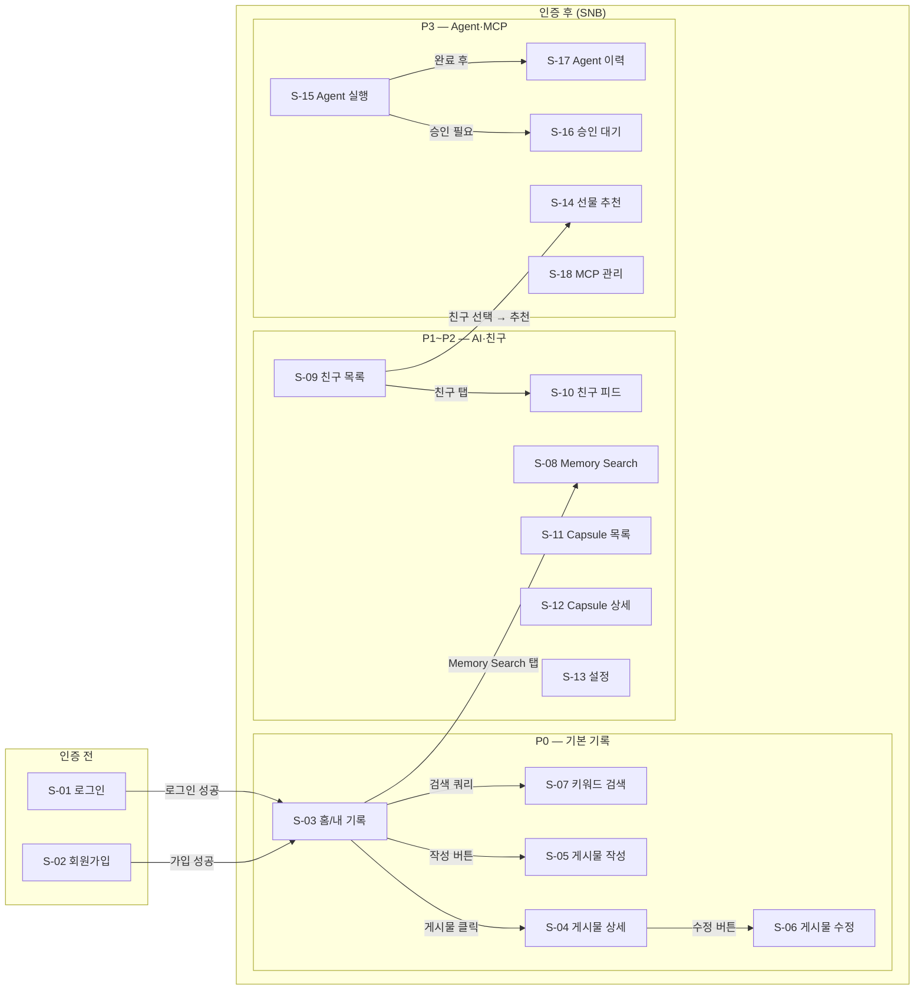
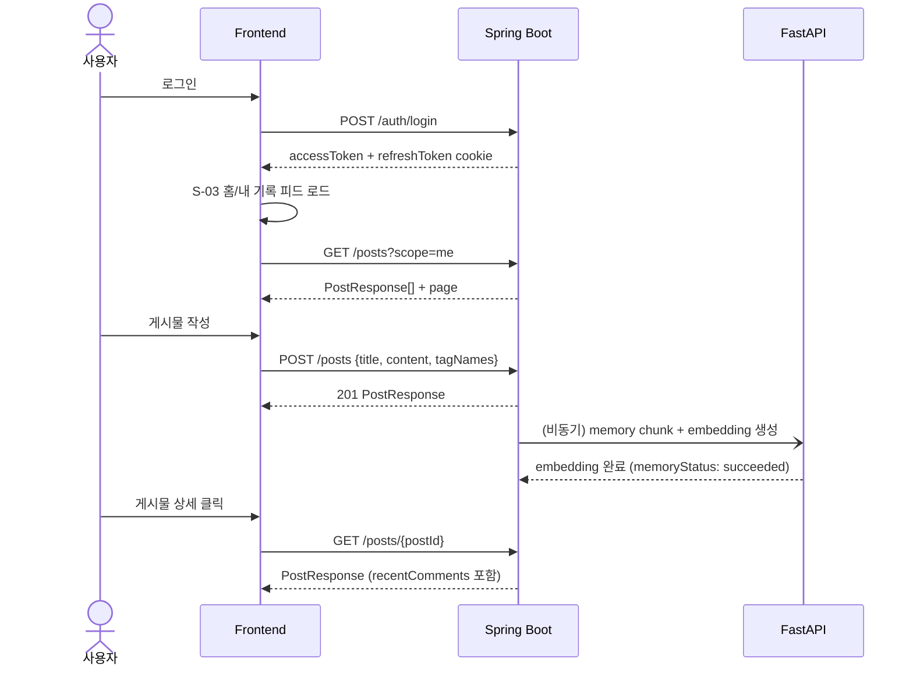
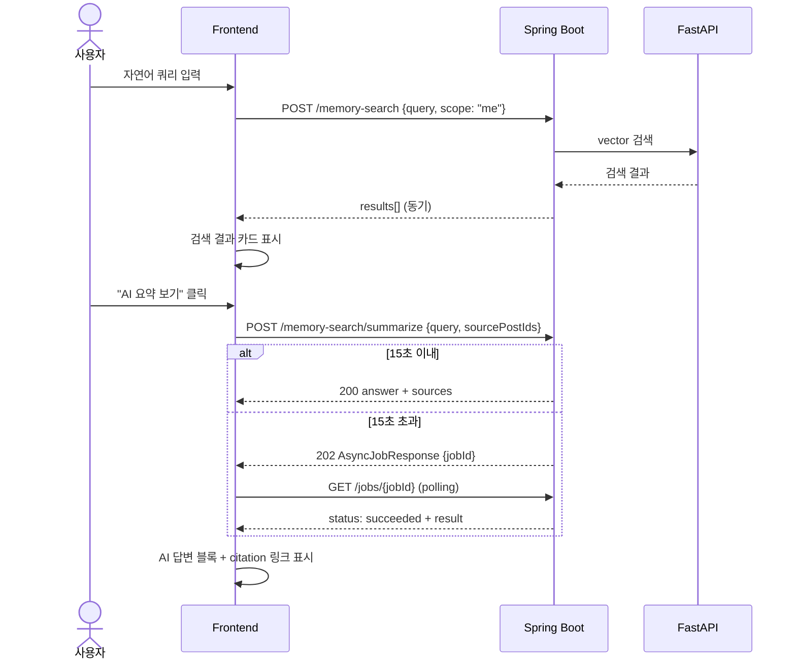
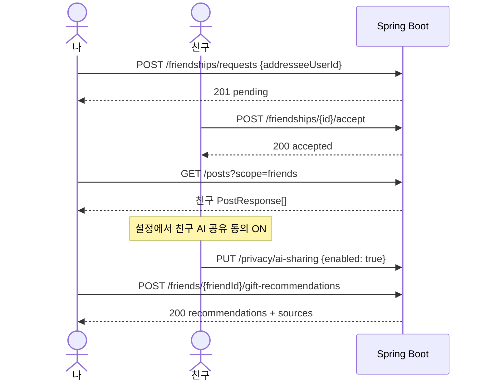
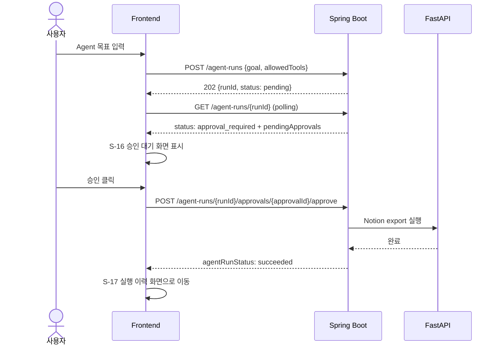

# 화면 흐름도 — 텍스트 기반 Memory MVP

> **기준 산출물**:  
> - 기능 요구사항: `docs/REQUIREMENTS_MVP_TEXT_MEMORY.md` §7  
> - API path: `docs/API_SPEC_MVP_TEXT_MEMORY.md`  
> - 디자인 토큰/컴포넌트: `docs/DESIGN.md`  
> - HTML 미리보기: `docs/design/memento-style-preview.html`

---

## 1. 문서 목적

이 문서는 Memento MVP의 화면 인벤토리, 네비게이션 맵, 핵심 사용자 여정, 화면별 상세 흐름을 고정한다.

- **구현자**가 어떤 화면에서 어떤 API를 호출하는지 같은 그림을 보게 한다.
- **설계자**가 누락된 상태(빈/로딩/에러/권한없음)나 API 매핑 공백을 미리 발견하게 한다.
- P0~P2는 화면 상세 + 저충실도 블록 스케치를 제공한다. P3는 흐름 위주 경량 기술이다.

표기 규칙:

- API path는 `/api/v1/` 접두어로 표기한다. (Base URL: `http://localhost:8080/api/v1`)
- 요구사항 ID는 `REQUIREMENTS_MVP_TEXT_MEMORY.md §7`의 ID를 그대로 사용한다.
- 저충실도 블록 스케치는 ASCII 코드펜스로 표현한다.

---

## 2. 화면 인벤토리

| 화면 ID | 이름 | 우선순위 | 주요 API | 접근 권한 |
|---------|------|----------|----------|-----------|
| S-01 | 로그인 | P0 | `POST /auth/login` | 비인증 |
| S-02 | 회원가입 | P0 | `POST /auth/signup` | 비인증 |
| S-03 | 홈 / 내 기록 피드 | P0 | `GET /posts?scope=me` | 인증 |
| S-04 | 게시물 상세 | P0~P2 | `GET /posts/{postId}`, `GET /posts/{postId}/comments` | 인증 (친구 포함) |
| S-05 | 게시물 작성 | P0~P1 | `POST /posts`, `GET /tags` | 인증 |
| S-06 | 게시물 수정 | P0 | `GET /posts/{postId}`, `PUT /posts/{postId}` | 인증 (작성자만) |
| S-07 | 키워드 검색 결과 | P0 | `GET /posts?q={keyword}&scope=…` | 인증 |
| S-08 | Memory Search + AI 요약 | P1~P2 | `POST /memory-search`, `POST /memory-search/summarize` | 인증 |
| S-09 | 친구 목록 / 친구 요청 | P2 | `GET /friendships`, `POST /friendships/requests` | 인증 |
| S-10 | 친구 기록 피드 | P2 | `GET /posts?scope=friends` | 인증 (accepted 친구) |
| S-11 | Context Capsule 목록 | P2 | `GET /context-capsules` | 인증 |
| S-12 | Context Capsule 상세 / 생성 | P2 | `GET /context-capsules/{capsuleId}`, `POST /context-capsules` | 인증 |
| S-13 | 설정 (AI 공유 동의) | P2 | `GET /auth/me`, `PUT /privacy/ai-sharing` | 인증 |
| S-14 | 친구 AI 기반 선물 추천 | P3 | `POST /friends/{friendId}/gift-recommendations` | 인증 + 친구 + AI 공유 동의 |
| S-15 | Agent 실행 / 결과 | P3 | `POST /agent-runs`, `GET /agent-runs/{runId}`, `GET /agent-runs/{runId}/steps` | 인증 |
| S-16 | Agent 승인 대기 | P3 | `POST /agent-runs/{runId}/approvals/{approvalId}/approve`, `.../reject` | 인증 |
| S-17 | Agent 실행 이력 | P3 | `GET /agent-runs/{runId}`, `GET /agent-runs/{runId}/steps` | 인증 |
| S-18 | MCP 연결 관리 | P3 | MCP Server tools, MCP Client (Notion) | 인증 |

---

## 3. 전역 네비게이션 맵



SNB 진입점 (항상 표시):

| SNB 아이템 | 이동 화면 |
|-----------|-----------|
| 홈 | S-03 |
| Memory Search | S-08 |
| Capsule | S-11 |
| 친구 | S-09 |
| Agent | S-15/S-17 |
| 설정 | S-13 |

---

## 4. 핵심 사용자 여정

### 4.1 기본 기록 여정 (P0)



### 4.2 Memory Search + AI 요약 여정 (P1~P2)



### 4.3 친구 관계 및 AI 공유 동의 여정 (P2)



### 4.4 Agent + 승인 여정 (P3)



---

## 5. 화면별 상세

### S-01 로그인

**목적**: 이메일·비밀번호로 인증하고 accessToken을 취득한다.  
**진입**: URL 직접 접근 (`/login`), 미인증 시 보호 경로 리다이렉트.  
**요구사항**: AUTH-004, AUTH-005, AUTH-008

| 액션 | API | 성공 결과 | 에러 |
|------|-----|----------|------|
| 로그인 제출 | `POST /api/v1/auth/login` | S-03 이동, token 저장 | 401: "이메일 또는 비밀번호가 올바르지 않습니다" |

**상태**:
- 기본: 인풋 + 제출 버튼
- 제출 중: 버튼 disabled + 로딩 스피너
- 에러: 인풋 하단 `text-error` 메시지

```
┌──────────────────────────────────────────┐
│  [M] Memento                             │
│                                          │
│  기억을 다시 꺼내 쓰는 공간             │
│                                          │
│  [이메일 _________________ ]             │
│  [비밀번호 _______________ ]             │
│                                          │
│  [로그인 ────────────────────]           │
│                                          │
│  계정이 없으신가요? 회원가입 →           │
└──────────────────────────────────────────┘
```

---

### S-02 회원가입

**목적**: 이메일·비밀번호·닉네임으로 계정을 만든다.  
**진입**: `/signup`, S-01에서 "회원가입" 링크 클릭.  
**요구사항**: AUTH-001, AUTH-002

| 액션 | API | 성공 결과 | 에러 |
|------|-----|----------|------|
| 가입 제출 | `POST /api/v1/auth/signup` | S-01 이동 (자동 로그인 옵션) | 400: 형식 오류 / 409: 이메일 중복 |

**상태**: 이메일 중복 시 해당 필드 `border-error` 강조.

```
┌────────────────────┬──────────────────────┐
│  브랜드 영역       │  가입 폼             │
│                    │                      │
│  Memento           │  닉네임 [_________]  │
│  기억을 기록하는   │  이메일 [_________]  │
│  나만의 공간       │  비밀번호 [________] │
│                    │                      │
│                    │  [가입하기 ───────]  │
│                    │  이미 계정 있음 →    │
└────────────────────┴──────────────────────┘
```

---

### S-03 홈 / 내 기록 피드

**목적**: 본인 게시물을 최신순으로 보고, 빠른 작성 / 검색으로 진입한다.  
**진입**: 로그인 직후, SNB "홈" 클릭.  
**요구사항**: POST-001, POST-004, SEARCH-001, SEARCH-003

| 액션 | API | 성공 결과 |
|------|-----|----------|
| 피드 로드 | `GET /api/v1/posts?scope=me&page=0` | 카드 목록 표시 |
| 더 보기 (무한스크롤/페이징) | `GET /api/v1/posts?scope=me&page=N` | 카드 추가 |
| 게시물 클릭 | — | S-04로 이동 |
| 작성 버튼 | — | S-05로 이동 |
| 검색창 입력 후 Enter | — | S-07로 이동 |

**상태**:
- 빈 상태: "아직 기록이 없어요" + "첫 기록 작성" 버튼
- 로딩: 카드 스켈레톤 3개
- `memoryStatus: failed` 게시물: 카드 우상단에 경고 아이콘 (재색인 안내)

```
┌───────────┬──────────────────────────────────────────┐
│ SNB       │  헤더: "내 기억"           [+ 기록 작성] │
│ (212px)   │  ─────────────────────────────────────── │
│           │  검색창 [자연어 또는 키워드로 검색...]   │
│ [홈] ◀   │                                          │
│ [검색]    │  ┌────────────┐  ┌────────────┐         │
│ [캡슐]    │  │ 카드 #1    │  │ 카드 #2    │         │
│ [친구]    │  │ 제목       │  │ 제목       │         │
│ [에이전트]│  │ 본문 요약… │  │ 본문 요약… │         │
│ [설정]    │  │ #태그 ♥4  │  │ #태그 ♥2  │         │
│           │  └────────────┘  └────────────┘         │
│ [아바타]  │                                          │
│ [≡ 접기]  │  [더 불러오기]                           │
└───────────┴──────────────────────────────────────────┘
```

---

### S-04 게시물 상세

**목적**: 게시물 전문 + 댓글 + 좋아요를 보고, 수정/삭제/댓글 작성을 수행한다.  
**진입**: S-03·S-07·S-08·S-10 카드 클릭.  
**요구사항**: POST-004, POST-005, POST-006, POST-008, COMMENT-001~006, FRIEND-007~010

| 액션 | API | 성공 결과 |
|------|-----|----------|
| 상세 로드 | `GET /api/v1/posts/{postId}` | 본문·최근 댓글 표시 |
| 댓글 전체 | `GET /api/v1/posts/{postId}/comments` | 댓글 목록 페이징 |
| 댓글 작성 | `POST /api/v1/posts/{postId}/comments` | 댓글 추가 |
| 댓글 수정 | `PUT /api/v1/comments/{commentId}` | 댓글 인라인 갱신 |
| 댓글 삭제 | `DELETE /api/v1/comments/{commentId}` | 댓글 제거 |
| 좋아요 | `POST /api/v1/posts/{postId}/likes` | 좋아요 수 증가 |
| 좋아요 취소 | `DELETE /api/v1/posts/{postId}/likes` | 좋아요 수 감소 |
| 수정 | — | S-06으로 이동 |
| 삭제 | `DELETE /api/v1/posts/{postId}` | S-03으로 이동 |

**상태**:
- 권한없음 (비친구): `404 Not Found` → "찾을 수 없는 게시물입니다" 에러 화면
- 로딩: 본문 스켈레톤
- 댓글 빈 상태: "첫 댓글을 남겨보세요"

```
┌───────────┬──────────────────────────────────────────┐
│ SNB       │  ← 돌아가기                  [수정] [삭제]│
│           │  ─────────────────────────────────────── │
│           │  # 태그1  # 태그2    3일 전 · 하윤서      │
│           │                                          │
│           │  제목 (text-ink text-heading)            │
│           │                                          │
│           │  본문 전문                               │
│           │  (text-bodytext, leading-relaxed)        │
│           │                                          │
│           │  ♥ 4   💬 2                             │
│           │  ─────────────────────────────────────── │
│           │  댓글 목록                               │
│           │  [avatar] 닉네임: 댓글 내용              │
│           │  ─────────────────────────────────────── │
│           │  [댓글 입력창 ____________] [작성]       │
└───────────┴──────────────────────────────────────────┘
```

---

### S-05 게시물 작성

**목적**: 제목·본문·태그를 입력해 새 기록을 생성한다.  
**진입**: S-03 "기록 작성" 버튼.  
**요구사항**: POST-001~003, TAG-001~005, MEMORY-001~003

| 액션 | API | 성공 결과 |
|------|-----|----------|
| 태그 목록 로드 | `GET /api/v1/tags` | 기존 태그 자동완성 |
| 제출 | `POST /api/v1/posts` | 201 → S-04 이동 |

**상태**:
- 태그 입력: 자동완성 드롭다운 (기존 태그 표시)
- 제출 중: 버튼 disabled + "저장 중…"
- 에러: 제목 필수 검증 메시지

```
┌───────────┬──────────────────────────────────────────┐
│ SNB       │  새 기록 작성              [취소] [저장] │
│           │  ─────────────────────────────────────── │
│           │  제목 [________________________________]  │
│           │                                          │
│           │  본문                                    │
│           │  ┌──────────────────────────────────┐   │
│           │  │                                  │   │
│           │  │  텍스트 에디터 (textarea)         │   │
│           │  │                                  │   │
│           │  └──────────────────────────────────┘   │
│           │                                          │
│           │  태그  [+ 태그 추가...]                  │
│           │  ┌─────┐ ┌──────┐                       │
│           │  │#회고│ │#카페 │  ← 선택된 태그        │
│           │  └─────┘ └──────┘                       │
│           │                                          │
│           │  ✦ AI 태그 제안 (P1 이후 표시)          │
└───────────┴──────────────────────────────────────────┘
```

---

### S-06 게시물 수정

**목적**: 기존 게시물의 제목·본문·태그를 수정한다.  
**진입**: S-04 "수정" 버튼 (작성자만 노출).  
**요구사항**: POST-005, MEMORY-003

| 액션 | API | 성공 결과 |
|------|-----|----------|
| 기존 데이터 로드 | `GET /api/v1/posts/{postId}` | 폼 pre-fill |
| 저장 | `PUT /api/v1/posts/{postId}` | 200 → S-04 이동 |

**상태**: S-05와 동일 구조. 초기값 pre-fill, "저장" 버튼 → 수정 완료.

---

### S-07 키워드 검색 결과

**목적**: 제목·본문·댓글·태그 키워드로 게시물을 찾는다.  
**진입**: S-03 검색창 Enter, SNB 검색 아이콘.  
**요구사항**: SEARCH-002~007

| 액션 | API | 성공 결과 |
|------|-----|----------|
| 검색 실행 | `GET /api/v1/posts?q={keyword}&scope=me&page=0` | 결과 카드 목록 |
| 범위 변경 (me/friends/all_accessible) | `GET /api/v1/posts?q={q}&scope={scope}` | 결과 갱신 |
| 태그 필터 추가 | `GET /api/v1/posts?q={q}&tag={tag}` | 결과 필터링 |
| 카드 클릭 | — | S-04 이동 |

**상태**:
- 빈 결과: "일치하는 기록이 없어요" + "Memory Search로 자연어 검색하기 →" 링크
- 로딩: 스켈레톤 3개

```
┌───────────┬──────────────────────────────────────────┐
│ SNB       │  검색 결과: "카페"                       │
│           │  ─────────────────────────────────────── │
│           │  검색창 [카페 ______________] [×]        │
│           │                                          │
│           │  범위: [내 기록▼]  태그: [전체▼]         │
│           │  총 7건                                  │
│           │                                          │
│           │  ┌───────────────────────────────────┐  │
│           │  │ 비 오는 날 성수동 카페에서  3일 전  │  │
│           │  │ 창가 자리에서 책을 읽었다…         │  │
│           │  │ # 카페  # 성수동   ♥ 4            │  │
│           │  └───────────────────────────────────┘  │
│           │  ┌───────────────────────────────────┐  │
│           │  │ …                                  │  │
│           │  └───────────────────────────────────┘  │
│           │  [1] [2] [3] … [다음 →]                 │
└───────────┴──────────────────────────────────────────┘
```

---

### S-08 Memory Search + AI 요약

**목적**: 자연어 쿼리로 벡터 검색 후 AI 요약과 근거 citation을 받는다.  
**진입**: SNB "검색" (Memory Search 탭), S-07 "자연어 검색" 링크.  
**요구사항**: RAG-001~012, EMBED-006~007

| 액션 | API | 성공 결과 |
|------|-----|----------|
| 자연어 검색 | `POST /api/v1/memory-search` | 결과 카드 목록 (동기) |
| AI 요약 요청 | `POST /api/v1/memory-search/summarize` | AI 답변 + citations |
| 비동기 폴링 | `GET /api/v1/jobs/{jobId}` | 요약 완료 시 표시 |
| 친구 범위 검색 | scope 파라미터 변경 | 친구 기록 포함 결과 |

**상태**:
- AI 요약 로딩: breathe 아이콘 + "기억에서 찾는 중…" 텍스트
- 요약 실패: "검색 결과는 있지만 요약을 생성하지 못했어요" (결과 카드는 유지)
- 결과 없음: RAG-007 대응 — "관련 기억을 찾지 못했어요" + 유사 키워드 제안

```
┌───────────┬──────────────────────────────────────────┐
│ SNB       │  Memory Search                           │
│           │  ─────────────────────────────────────── │
│           │  [작년 가을 카페에서 남긴 기록 찾아줘  ] │
│           │  [내 기억 ▼]                  [검색 →]  │
│           │                                          │
│           │  ┌─────────────────────────────────────┐│
│           │  │ ✦ AI 요약                           ││
│           │  │ 작년 가을 비 오는 날 카페에서…      ││
│           │  │ [📄 성수동 카페]  [📄 10월 회고]   ││
│           │  └─────────────────────────────────────┘│
│           │                                          │
│           │  관련 기록 3건                            │
│           │  ┌───────────────────────────────────┐  │
│           │  │ 비 오는 날 성수동 카페에서 · 유사도 0.82│
│           │  └───────────────────────────────────┘  │
└───────────┴──────────────────────────────────────────┘
```

---

### S-09 친구 목록 / 친구 요청

**목적**: 친구 목록 조회, 요청 발신·수락·거절, AI 공유 동의 상태를 확인한다.  
**진입**: SNB "친구" 클릭.  
**요구사항**: FRIEND-001~011

| 액션 | API | 성공 결과 |
|------|-----|----------|
| 친구 목록 | `GET /api/v1/friendships?status=accepted` | 친구 카드 목록 |
| 수신 요청 목록 | `GET /api/v1/friendships?status=pending` | 요청 카드 목록 |
| 친구 요청 발신 | `POST /api/v1/friendships/requests` | pending 뱃지 추가 |
| 요청 수락 | `POST /api/v1/friendships/{id}/accept` | 친구 목록으로 이동 |
| 요청 거절 | `POST /api/v1/friendships/{id}/reject` | 요청 목록에서 제거 |
| 친구 해제 | `DELETE /api/v1/friendships/{id}` | 목록에서 제거 |
| 친구 기록 보기 | — | S-10 이동 |
| 선물 추천 | — | S-14 이동 (AI 공유 동의 확인 후) |

**상태**:
- AI 공유 동의 여부: 친구 카드에 `✓ AI 공유 동의` / `AI 공유 미동의` 뱃지 표시
- 수신 요청 뱃지: SNB 아이콘 우상단 숫자 뱃지

```
┌───────────┬──────────────────────────────────────────┐
│ SNB       │  친구               [+ 친구 추가]        │
│           │  ─────────────────────────────────────── │
│           │  [친구 목록] [받은 요청 (2)]              │
│           │                                          │
│           │  ┌───────────────────────────────────┐  │
│           │  │ [아] 하윤서  ✓ AI 공유 동의       │  │
│           │  │ [기록 보기]  [선물 추천]  [···]   │  │
│           │  └───────────────────────────────────┘  │
│           │  ┌───────────────────────────────────┐  │
│           │  │ [아] 김민준  AI 공유 미동의        │  │
│           │  │ [기록 보기]          [···]        │  │
│           │  └───────────────────────────────────┘  │
└───────────┴──────────────────────────────────────────┘
```

---

### S-10 친구 기록 피드

**목적**: 승인된 친구의 게시물을 조회하고 댓글·좋아요를 남긴다.  
**진입**: S-09 "기록 보기" 버튼.  
**요구사항**: POST-008~009, FRIEND-006~010

| 액션 | API | 성공 결과 |
|------|-----|----------|
| 친구 피드 로드 | `GET /api/v1/posts?scope=friends` | 친구 카드 목록 |
| 좋아요 | `POST /api/v1/posts/{postId}/likes` | 카운트 증가 |
| 카드 클릭 | — | S-04 이동 (수정·삭제 버튼 숨김) |

**상태**: 수정·삭제 버튼은 본인 게시물에만 노출. 친구 게시물에는 `accessScope: friend` 표시.

---

### S-11 Context Capsule 목록

**목적**: 생성한 Capsule 목록을 조회하고 새 Capsule을 만든다.  
**진입**: SNB "캡슐" 클릭.  
**요구사항**: CAPSULE-001, CAPSULE-005, CAPSULE-008

| 액션 | API | 성공 결과 |
|------|-----|----------|
| 목록 로드 | `GET /api/v1/context-capsules` | Capsule 카드 목록 |
| Capsule 클릭 | — | S-12 상세로 이동 |
| 새 Capsule | — | S-12 생성 폼으로 이동 |
| 삭제 | `DELETE /api/v1/context-capsules/{capsuleId}` | 목록에서 제거 |

**상태**: 빈 상태 — "아직 컨텍스트 캡슐이 없어요" + "새 캡슐 만들기".

---

### S-12 Context Capsule 상세 / 생성

**목적**: Capsule의 요약·핵심사실·출처를 보거나 compact JSON을 복사한다. 생성 시 목적·쿼리를 입력한다.  
**진입**: S-11 카드 클릭 (상세) 또는 "새 캡슐" 버튼 (생성).  
**요구사항**: CAPSULE-001~010

| 액션 | API | 성공 결과 |
|------|-----|----------|
| 상세 로드 | `GET /api/v1/context-capsules/{capsuleId}` | summary·keyFacts·sources 표시 |
| Capsule 생성 | `POST /api/v1/context-capsules` | 201 → 상세로 이동 |
| 수정 | `PUT /api/v1/context-capsules/{capsuleId}` | 제목·목적 갱신 |
| compact JSON 복사 | — | 클립보드 복사 + 토스트 |

**상태**:
- `containsFriendContext: true`인 경우: "친구 데이터 포함" 경고 뱃지 표시
- compact JSON 영역: `bg-raised rounded-xl pre` 스타일 + 복사 버튼

```
┌───────────┬──────────────────────────────────────────┐
│ SNB       │  Context Capsule        [수정] [삭제]    │
│           │  ─────────────────────────────────────── │
│           │  내 프로젝트 맥락                        │
│           │  목적: 외부 LLM에게 최근 프로젝트 맥락 전달│
│           │                                          │
│           │  요약: 최근 프로젝트에서는 인증, 친구…   │
│           │                                          │
│           │  핵심 사실                               │
│           │  · JWT Bearer 인증을 사용한다.           │
│           │  · 친구 AI 활용은 opt-in이 필요하다.    │
│           │                                          │
│           │  ┌─────────────────────────────────────┐│
│           │  │ compact JSON                    [복사]││
│           │  │ { "summary": "...", "keyFacts": [] } ││
│           │  └─────────────────────────────────────┘│
│           │  출처: [📄 인증 회고] [📄 API 결정]     │
└───────────┴──────────────────────────────────────────┘
```

---

### S-13 설정

**목적**: 친구 AI 공유 동의를 켜거나 끈다. 내 정보를 확인한다.  
**진입**: SNB "설정" 클릭.  
**요구사항**: FRIEND-011, FRIEND-012, AUTH-007

| 액션 | API | 성공 결과 |
|------|-----|----------|
| 내 정보 로드 | `GET /api/v1/auth/me` | 이메일·닉네임·동의 상태 표시 |
| AI 공유 동의 토글 | `PUT /api/v1/privacy/ai-sharing {enabled}` | 토글 상태 갱신 + 토스트 |
| 로그아웃 | `POST /api/v1/auth/logout` | S-01로 이동 |

**상태**:
- 토글 ON: 성공 녹색 도트 + "활성화됨"
- 토글 OFF: muted 도트 + "비활성화됨"
- 동의 켤 때: "친구가 내 기록을 AI 검색 근거로 사용할 수 있게 됩니다" 확인 모달

---

### S-14 친구 AI 기반 선물 추천 (P3)

**목적**: 친구의 AI 공유 동의 기록을 기반으로 선물을 추천받는다.  
**진입**: S-09 친구 카드 "선물 추천" 버튼 (AI 공유 동의 확인된 친구만 활성화).  
**요구사항**: AGENT-011, RAG-009~012

| 액션 | API | 성공 결과 |
|------|-----|----------|
| 추천 요청 | `POST /api/v1/friends/{friendId}/gift-recommendations` | 추천 목록 + sources |
| 비동기 폴링 | `GET /api/v1/jobs/{jobId}` | 완료 시 결과 표시 |

**권한 가드**: 진입 전 `friendAiSharingEnabled` 확인. `false`이면 버튼 비활성 + "친구가 AI 공유에 동의하지 않았습니다" 툴팁.

**면책 고지**: AI 답변 하단에 "친구가 AI 공유에 동의한 기록만을 기반으로 답합니다" 표시 (DESIGN.md AI 답변 블록 패턴).

---

### S-15 Agent 실행 / 결과 (P3)

**목적**: 목표를 입력하고 Agent가 단계별로 실행하는 과정을 확인한다.  
**진입**: SNB "에이전트" 클릭.  
**요구사항**: AGENT-001~011

| 액션 | API | 성공 결과 |
|------|-----|----------|
| 실행 시작 | `POST /api/v1/agent-runs` | 202 runId |
| 상태 폴링 | `GET /api/v1/agent-runs/{runId}` | 상태 갱신 |
| 스텝 목록 | `GET /api/v1/agent-runs/{runId}/steps` | step 타임라인 |
| 승인 필요 | status = `approval_required` | S-16으로 이동 |

**상태 배지**: `pending` — 회색, `running` — floaty amber dot, `approval_required` — "승인 대기" warn 카드, `succeeded` — 녹색, `failed` — error 빨간색.

---

### S-16 Agent 승인 대기 (P3)

**목적**: 외부 쓰기 작업 실행 전 사용자 승인 또는 거절.  
**진입**: S-15에서 `approval_required` 상태 감지.  
**요구사항**: AGENT-008, AGENT-009, MCP-010

| 액션 | API | 성공 결과 |
|------|-----|----------|
| 승인 | `POST /api/v1/agent-runs/{runId}/approvals/{approvalId}/approve` | Agent 재개 |
| 거절 | `POST /api/v1/agent-runs/{runId}/approvals/{approvalId}/reject` | Agent 취소 |

**규칙**: 외부 쓰기(Notion 등)는 승인 전 절대 실행되지 않는다. 승인 버튼은 승인 대기 상태에서만 활성화.

---

### S-17 Agent 실행 이력 (P3)

**목적**: 완료·실패한 Agent 실행의 스텝별 입출력을 확인한다.  
**진입**: S-15 완료 후, SNB "에이전트 이력" 탭.  
**요구사항**: AGENT-006, AGENT-007

| 액션 | API | 성공 결과 |
|------|-----|----------|
| 이력 목록 | `GET /api/v1/agent-runs/{runId}` | 실행 요약 |
| 스텝 상세 | `GET /api/v1/agent-runs/{runId}/steps` | step 타임라인 (입출력 요약) |

**상태 배지**: `succeeded` — 녹색, `failed` — 빨간색, `approval_required` — warn, `running` — floaty dot.

---

### S-18 MCP 연결 관리 (P3)

**목적**: MCP Server tool 목록과 Notion MCP Client 연동 상태·호출 이력을 확인한다.  
**진입**: 설정 내 "MCP 연결" 탭 또는 SNB 설정 하위.  
**요구사항**: MCP-001~013

| 섹션 | 내용 |
|------|------|
| MCP Server tools | `search_memories`, `get_context_capsule`, `summarize_recent_posts` + 각 권한 scope 표시 |
| MCP Client (Notion) | 연결 상태, 마지막 호출 시각, 실패 이력 |

**상태**: 외부 호출 실패 시 `error` 뱃지 + 실패 이유 표시 (MCP-011).

---

## 6. 상태 / 에러 공통 패턴

### 6.1 로딩 스켈레톤

모든 목록·상세 로드 시 스켈레톤 카드를 표시하고, 데이터 도착 후 전환한다.

```html
<!-- 카드 스켈레톤 예시 -->
<div class="bg-surface border border-hairline rounded-xl p-4 animate-pulse">
  <div class="h-3 bg-raised rounded-full w-1/3 mb-3"></div>
  <div class="h-4 bg-raised rounded-full w-3/4 mb-2"></div>
  <div class="h-3 bg-raised rounded-full w-full mb-1"></div>
  <div class="h-3 bg-raised rounded-full w-4/5"></div>
</div>
```

### 6.2 빈 상태

| 화면 | 아이콘 | 메시지 | 액션 |
|------|--------|--------|------|
| 홈 피드 | `solar:notebook-minimalistic-linear` | 아직 기록이 없어요 | "첫 기록 작성" 버튼 |
| 검색 결과 | `solar:magnifer-linear` | 일치하는 기록이 없어요 | "자연어 검색 시도" 링크 |
| Memory Search | `solar:magic-stars-linear` | 관련 기억을 찾지 못했어요 | — |
| Capsule 목록 | `solar:box-minimalistic-linear` | 캡슐이 없어요 | "새 캡슐 만들기" 버튼 |
| 친구 목록 | `solar:users-group-rounded-linear` | 아직 친구가 없어요 | "친구 추가" 버튼 |
| 수신 요청 | — | 받은 요청이 없어요 | — |

### 6.3 에러 처리

| HTTP 코드 | 화면 대응 |
|-----------|-----------|
| 400 | 해당 인풋 필드 하단 `text-error text-[12px]` 메시지 |
| 401 | 토큰 갱신 시도 (`POST /auth/refresh`) → 실패 시 S-01 리다이렉트 |
| 403 | "수행 권한이 없습니다" 토스트 (bg-error) |
| 404 | "찾을 수 없는 게시물입니다" 페이지 에러 화면 |
| 409 | 중복 필드 에러 메시지 (이메일 중복 등) |
| 422 | 도메인 규칙 위반 토스트 |
| 500/502 | "일시적인 오류가 발생했어요. 잠시 후 다시 시도해주세요" 토스트 (bg-error) |

### 6.4 권한없음 분기 (§6.2 권한 원칙 적용)

| 상황 | 화면 처리 |
|------|-----------|
| 비친구 게시물 접근 | 404 에러 화면 (존재 숨김) |
| 친구 AI 공유 미동의 | 선물 추천 버튼 disabled + 툴팁 안내 |
| Agent 외부 쓰기 미승인 | S-16 승인 대기 화면으로 강제 진입 |
| MCP tool 권한 부족 | 403 → MCP 호출 이력에 실패 기록 |

### 6.5 비동기 작업 공통 패턴

`202 Accepted` 응답을 받은 경우:

1. `GET /api/v1/jobs/{jobId}` 폴링 (1~3초 간격 권장).
2. `status: running` — 로딩 인디케이터 (breathe 아이콘 + "처리 중…").
3. `status: succeeded` — 결과 표시, 폴링 중단.
4. `status: failed` — 에러 토스트 + 재시도 버튼.

---

## 7. 추적 매트릭스

### 7.1 화면 ↔ 요구사항 ID ↔ API path

| 화면 ID | 요구사항 ID (핵심) | 주요 API path |
|---------|--------------------|--------------|
| S-01 | AUTH-004, AUTH-005, AUTH-008 | `POST /api/v1/auth/login` |
| S-02 | AUTH-001, AUTH-002 | `POST /api/v1/auth/signup` |
| S-03 | POST-004, SEARCH-001, SEARCH-003 | `GET /api/v1/posts?scope=me` |
| S-04 | POST-004, POST-008, COMMENT-001~006, FRIEND-007~010 | `GET /api/v1/posts/{postId}`, `GET /api/v1/posts/{postId}/comments`, `POST /api/v1/posts/{postId}/comments`, `POST /api/v1/posts/{postId}/likes`, `DELETE /api/v1/posts/{postId}/likes` |
| S-05 | POST-001~003, TAG-001~005, MEMORY-001~003 | `POST /api/v1/posts`, `GET /api/v1/tags` |
| S-06 | POST-005, MEMORY-003 | `GET /api/v1/posts/{postId}`, `PUT /api/v1/posts/{postId}` |
| S-07 | SEARCH-002~007 | `GET /api/v1/posts?q=…&scope=…` |
| S-08 | RAG-001~012, EMBED-006~007 | `POST /api/v1/memory-search`, `POST /api/v1/memory-search/summarize`, `GET /api/v1/jobs/{jobId}` |
| S-09 | FRIEND-001~012 | `GET /api/v1/friendships`, `POST /api/v1/friendships/requests`, `POST /api/v1/friendships/{id}/accept`, `POST /api/v1/friendships/{id}/reject`, `DELETE /api/v1/friendships/{id}` |
| S-10 | POST-008~009, FRIEND-006~010 | `GET /api/v1/posts?scope=friends`, `POST /api/v1/posts/{postId}/likes` |
| S-11 | CAPSULE-005, CAPSULE-008 | `GET /api/v1/context-capsules` |
| S-12 | CAPSULE-001~010 | `GET /api/v1/context-capsules/{capsuleId}`, `POST /api/v1/context-capsules`, `PUT /api/v1/context-capsules/{capsuleId}`, `DELETE /api/v1/context-capsules/{capsuleId}` |
| S-13 | FRIEND-011, FRIEND-012, AUTH-007 | `GET /api/v1/auth/me`, `PUT /api/v1/privacy/ai-sharing`, `POST /api/v1/auth/logout` |
| S-14 | AGENT-011, RAG-009~012 | `POST /api/v1/friends/{friendId}/gift-recommendations`, `GET /api/v1/jobs/{jobId}` |
| S-15 | AGENT-001~011 | `POST /api/v1/agent-runs`, `GET /api/v1/agent-runs/{runId}`, `GET /api/v1/agent-runs/{runId}/steps` |
| S-16 | AGENT-008~009, MCP-010 | `POST /api/v1/agent-runs/{runId}/approvals/{approvalId}/approve`, `.../reject` |
| S-17 | AGENT-006~007 | `GET /api/v1/agent-runs/{runId}`, `GET /api/v1/agent-runs/{runId}/steps` |
| S-18 | MCP-001~013 | MCP Server tools, MCP Client (Notion) |

### 7.2 P0~P3 기능 커버리지 역검증

| 우선순위 | 요구사항 모듈 | 대응 화면 |
|----------|-------------|-----------|
| P0 | AUTH | S-01, S-02, S-13 (로그아웃) |
| P0 | POST CRUD | S-03, S-04, S-05, S-06 |
| P0 | COMMENT | S-04 |
| P0 | TAG | S-05, S-07 |
| P0 | SEARCH (키워드) | S-07 |
| P0 | FRIEND (기본) | S-09, S-10 |
| P1 | MEMORY CHUNK / EMBED | S-05 (비동기 처리, 배경) |
| P1 | Memory Search (벡터) | S-08 |
| P2 | AI 요약 + citation | S-08 |
| P2 | Context Capsule | S-11, S-12 |
| P2 | 친구 AI 동의 설정 | S-13 |
| P2 | 좋아요 | S-04, S-10 |
| P3 | 선물 추천 | S-14 |
| P3 | Agent Workflow | S-15 |
| P3 | Agent 승인 | S-16 |
| P3 | Agent 이력 | S-17 |
| P3 | MCP Server/Client | S-18 |

---

## 8. 남은 검토 항목

| # | 항목 | 비고 |
|---|------|------|
| 1 | Memory Search 결과 스크롤 vs. 페이징 전략 | UX 결정 필요 |
| 2 | Agent 실행 목록 화면 분리 여부 | S-15(신규 실행)와 S-17(이력)를 탭으로 합칠지 분리할지 |
| 3 | Capsule 생성 시 Memory Search 연동 UX | "검색 결과에서 바로 Capsule 생성" 버튼 위치 |
| 4 | 친구 게시물 피드 무한스크롤 vs. 페이징 | SEARCH-003 응답 페이징 구조와 정렬 |
| 5 | MCP wire protocol 확정 후 S-18 화면 세부화 | MCP 설계 문서 완성 이후 |
| 6 | `memoryStatus: failed` 게시물 재색인 UX | `POST /api/v1/memories/reindex` 진입점 위치 |
| 7 | 토큰 갱신 실패 시 UX 분기 | `POST /api/v1/auth/refresh` 401 → 전역 가로채기 vs. 화면별 처리 |
| 8 | 모바일 반응형 SNB 처리 | `< 640px`: 상단 헤더 + 햄버거 메뉴 패턴 설계 필요 |
