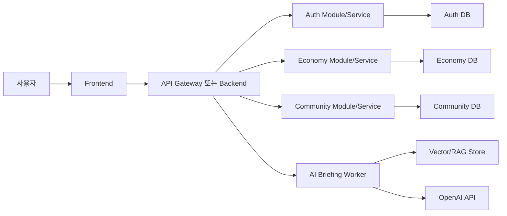

# 마이크로서비스 아키텍처 개발 진행 절차

## 목적

마이크로서비스 아키텍처는 단순히 서버를 여러 개로 나누는 방식이 아니라, 비즈니스 경계와 데이터 소유권을 기준으로 시스템을 독립적으로 진화시키는 개발 방식이다. 그래서 일반적인 `기획 -> ERD -> 개발 -> 테스트` 흐름을 그대로 적용하기보다, MVP와 도메인 경계를 먼저 좁히고 서비스별 계약, 데이터, 배포, 관측, 테스트 전략을 함께 설계해야 한다.

## 전체 흐름 요약

1. 제품 기획과 MVP 범위를 정한다.
2. 핵심 도메인과 사용자 여정을 정의한다.
3. 바운디드 컨텍스트를 나누고 서비스 후보를 정한다.
4. 서비스 간 통신 방식과 데이터 소유권을 결정한다.
5. 서비스별 ERD와 API 계약을 작성한다.
6. 아키텍처 다이어그램과 운영 토폴로지를 만든다.
7. 테스트 전략을 계층별로 설계한다.
8. CI/CD, 관측성, 장애 대응 기준을 만든다.
9. 모놀리식 또는 모듈형 MVP에서 점진적으로 서비스를 분리한다.
10. 출시 후 지표를 보고 서비스 경계를 재조정한다.

## 1단계: 제품 기획

### 산출물

- 문제 정의서
- 사용자 페르소나
- 핵심 사용자 여정
- 기능 목록
- 우선순위 표
- 성공 지표

### 진행 방식

먼저 시스템을 기술 관점이 아니라 제품 관점에서 정의한다. 예를 들어 `AI가 읽는 미국경제 대시보드`라면 사용자는 경제 지표를 빠르게 이해하고, AI 요약을 보고, 토론하거나 알림을 받을 수 있어야 한다.

이 단계에서는 다음 질문을 정리한다.

- 사용자가 해결하려는 문제는 무엇인가?
- 반드시 필요한 첫 화면은 무엇인가?
- 회원가입 없이 볼 수 있는 정보와 로그인 후 가능한 행동은 무엇인가?
- 관리자가 반드시 통제해야 하는 기능은 무엇인가?
- AI 기능이 제품의 핵심인가, 보조 기능인가?

## 2단계: MVP 범위 정의

### 산출물

- MVP 기능 목록
- 제외 기능 목록
- 릴리스 기준
- 위험 목록

### 진행 방식

마이크로서비스는 초기에 너무 잘게 나누면 배포, 테스트, 장애 분석 비용이 커진다. 따라서 MVP에서는 기능을 작게 만들되, 서비스 경계가 나중에 분리될 수 있도록 모듈 경계를 먼저 명확히 둔다.

예시 MVP 범위는 다음처럼 나눌 수 있다.

- 경제 지표 조회
- 지표 히스토리 조회
- AI 요약 생성
- 게시판과 댓글
- 로컬 로그인과 이메일 인증
- 관리자 콘솔

v1에서 제외할 수 있는 항목은 다음과 같다.

- 전체 사용자 MFA
- 완전한 실시간 알림
- 고도화된 결제/구독
- 서비스별 독립 배포
- 복잡한 이벤트 소싱

## 3단계: 도메인 분석과 바운디드 컨텍스트

### 산출물

- 도메인 용어집
- 이벤트 스토밍 결과
- 바운디드 컨텍스트 목록
- 서비스 후보 목록

### 진행 방식

마이크로서비스의 단위는 테이블 단위가 아니라 비즈니스 책임 단위다. 그래서 먼저 도메인을 다음처럼 나눈다.

| 컨텍스트 | 책임 | 서비스 후보 |
| --- | --- | --- |
| 사용자/인증 | 계정, 로그인, 권한, MFA | Auth Service |
| 경제 데이터 | 지표 수집, 캐시, 히스토리 | Economy Data Service |
| AI 브리핑 | 요약, 분석, 근거 추적 | AI Briefing Service |
| 커뮤니티 | 게시글, 댓글, 신고 | Community Service |
| 관리자 | 운영 정책, 감사 로그, 수동 동기화 | Admin Service |
| 알림 | 이메일, 웹 알림, 재발송 | Notification Service |

초기에는 하나의 백엔드 안에 패키지 또는 모듈로 구현해도 된다. 중요한 것은 코드 구조, 데이터 접근, API 계약이 나중에 분리 가능한 방향이어야 한다는 점이다.

## 4단계: 서비스 분리 기준

### 판단 기준

서비스 분리는 다음 기준을 모두 검토한 뒤 결정한다.

- 데이터 소유권이 독립적인가?
- 배포 주기가 다른가?
- 장애 격리가 필요한가?
- 트래픽 패턴이 다른가?
- 보안 요구사항이 다른가?
- 팀 소유권을 나눌 필요가 있는가?

### 권장 순서

처음부터 모든 기능을 물리적 마이크로서비스로 나누기보다 다음 순서가 안전하다.

1. 모듈형 모놀리스로 시작한다.
2. 패키지와 DB 접근 경계를 분리한다.
3. 내부 API 계약을 문서화한다.
4. 트래픽과 장애 지표를 관찰한다.
5. 독립 배포 가치가 큰 기능부터 분리한다.

## 5단계: ERD 설계

### 원칙

마이크로서비스에서는 전체 시스템을 하나의 거대한 ERD로 끝내지 않는다. 전체 개념 ERD는 만들 수 있지만, 실제 소유 테이블은 서비스별로 나눈다.

### 산출물

- 전체 개념 ERD
- 서비스별 물리 ERD
- 데이터 소유권 표
- 외래키 경계 규칙

### 예시

| 서비스 | 소유 데이터 | 다른 서비스 참조 방식 |
| --- | --- | --- |
| Auth | 사용자, 역할, 인증 토큰, MFA | `userId`만 공개 |
| Economy | 지표, 관측치, 이벤트, 리포트 | 사용자 테이블 직접 참조 금지 |
| Community | 게시글, 댓글, 신고 | 작성자 `userId` 저장 |
| AI Briefing | 실행 기록, 근거, 추적 로그 | 지표 ID와 게시글 ID 참조 |
| Admin | 감사 로그, 운영 액션 | 대상 ID와 타입 저장 |

서비스 간 DB 직접 조인은 피하고, 필요한 경우 API 조회, 캐시, 이벤트 구독, 읽기 모델을 사용한다.

## 6단계: API 계약과 이벤트 계약

### 산출물

- OpenAPI 문서
- 요청/응답 DTO
- 오류 코드 표
- 이벤트 스키마
- 버전 정책

### REST 계약 예시

- `GET /api/economy/dashboard`
- `GET /api/economy/metrics/{metricId}/history`
- `POST /api/auth/signup`
- `POST /api/auth/verify-email-code`
- `POST /api/community/posts`
- `POST /api/ai/briefings`

### 이벤트 계약 예시

- `UserRegistered`
- `EmailVerified`
- `EconomicDataSynced`
- `BriefingGenerated`
- `PostReported`
- `AdminActionLogged`

동기 API는 즉시 응답이 필요한 조회와 명령에 사용하고, 비동기 이벤트는 후속 처리, 알림, AI 작업, 감사 로그에 사용한다.

## 7단계: 아키텍처 설계

### 산출물

- C4 Context Diagram
- Container Diagram
- Component Diagram
- 배포 다이어그램
- 네트워크/보안 경계도
- ADR

### 설계 항목

아키텍처 문서에는 최소한 다음 항목이 있어야 한다.

- 프론트엔드와 백엔드 라우팅
- 인증 쿠키와 CSRF 흐름
- 서비스별 책임
- DB 분리 전략
- 캐시 전략
- 메시지 큐 사용 여부
- 외부 API 연동
- 장애 격리 방식
- 운영자 접근 방식

### 예시 구조

## 8단계: 테스트 전략

### 테스트 피라미드

| 테스트 | 목적 | 실행 시점 |
| --- | --- | --- |
| Unit Test | 도메인 로직 검증 | PR마다 |
| Integration Test | DB/API 연동 검증 | PR마다 |
| Contract Test | 서비스 간 계약 검증 | 서비스 분리 전후 |
| E2E Test | 핵심 사용자 흐름 검증 | 릴리스 전 |
| Security Test | 인증/권한/입력 검증 | 인증 변경 시 |
| Load Test | 트래픽과 병목 확인 | 주요 릴리스 전 |
| Chaos Test | 장애 전파 확인 | 운영 안정화 이후 |

### 마이크로서비스에서 중요한 테스트

마이크로서비스는 단위 테스트보다 계약 테스트의 중요도가 올라간다. 한 서비스가 응답 필드를 바꾸면 다른 서비스가 깨질 수 있기 때문이다.

필수 테스트 예시는 다음과 같다.

- Auth가 발급한 사용자 정보 계약이 Admin과 Community에서 유지되는지
- Economy 지표 API 응답이 AI Briefing 입력으로 유효한지
- Community 신고 이벤트가 Admin 감사 로그로 이어지는지
- 이메일 인증 실패 횟수가 트랜잭션 롤백 없이 저장되는지
- 외부 API 실패 시 fallback 또는 상태 코드가 일관적인지

## 9단계: CI/CD와 배포 전략

### 산출물

- 브랜치 전략
- 빌드 파이프라인
- 테스트 파이프라인
- 배포 파이프라인
- 롤백 절차

### 권장 흐름

1. PR 생성
2. 정적 검사
3. 단위 테스트
4. 통합 테스트
5. 컨테이너 빌드
6. 스테이징 배포
7. Smoke Test
8. 운영 배포
9. 모니터링 확인

서비스가 분리되면 각 서비스는 독립 배포되지만, 공통 계약 테스트와 E2E Smoke Test는 전체 시스템 기준으로 유지해야 한다.

## 10단계: 관측성과 운영 설계

### 필수 관측 항목

- 요청 수
- 오류율
- 응답 시간
- DB 쿼리 시간
- 큐 적체량
- 외부 API 실패율
- 인증 실패율
- 이메일 발송 실패율
- AI 작업 실패율

### 로그 기준

서비스 간 호출에는 공통 추적 ID를 둔다.

- `traceId`
- `userId`
- `service`
- `action`
- `targetType`
- `targetId`
- `status`

관리자 액션, 인증 실패, 권한 변경, 데이터 동기화 실패는 감사 로그 또는 운영 로그로 반드시 남긴다.

## 11단계: 데이터 일관성과 트랜잭션

### 원칙

마이크로서비스에서는 서비스 간 분산 트랜잭션을 기본값으로 두지 않는다. 각 서비스는 자기 DB에서 트랜잭션을 끝내고, 다른 서비스에는 이벤트나 보상 트랜잭션으로 상태를 맞춘다.

### 패턴

- Saga
- Outbox Pattern
- Idempotency Key
- Retry with Backoff
- Dead Letter Queue
- Read Model

예를 들어 회원가입 후 이메일 발송은 다음처럼 처리할 수 있다.

1. Auth Service가 사용자 생성 트랜잭션을 완료한다.
2. `UserRegistered` 이벤트를 outbox에 저장한다.
3. Notification Service가 이벤트를 읽고 이메일을 보낸다.
4. 실패하면 재시도하고, 계속 실패하면 DLQ에 저장한다.

## 12단계: 보안 설계

### 체크리스트

- 인증과 인가 분리
- HttpOnly 쿠키 사용 여부
- CSRF 정책
- 비밀번호 정책
- 이메일 인증
- 관리자 MFA
- Rate Limit
- CAPTCHA
- 감사 로그
- 개인정보 최소 수집
- 서비스 간 인증

서비스가 분리되면 내부 서비스 호출도 신뢰하지 않는다는 전제로 설계해야 한다. 내부망이라고 해서 인증을 생략하면 안 된다.

## 13단계: 개발 순서 예시

### 1주차

- MVP 기능 정의
- 핵심 사용자 여정 작성
- 도메인 용어집 작성
- 바운디드 컨텍스트 초안 작성

### 2주차

- 전체 개념 ERD 작성
- 서비스별 데이터 소유권 결정
- API 계약 초안 작성
- 아키텍처 다이어그램 작성

### 3주차

- 모듈형 모놀리스 구조 구현
- 핵심 DB 마이그레이션 작성
- 인증/경제 데이터/게시판 기본 API 구현
- 단위 테스트와 통합 테스트 작성

### 4주차

- 프론트 핵심 화면 연결
- 관리자 콘솔 추가
- AI 브리핑 워커 연결
- CI/CD와 운영 스크립트 구성

### 5주차 이후

- 부하와 장애 지표 확인
- 독립 배포 가치가 큰 모듈 선별
- 서비스 분리
- 계약 테스트 강화
- 관측성과 알림 강화

## 실무 의사결정 기준

### 처음부터 마이크로서비스로 가도 되는 경우

- 팀이 여러 개이고 서비스 소유권이 분명하다.
- 서비스별 배포 주기가 명확히 다르다.
- 데이터와 트래픽 경계가 이미 검증됐다.
- 운영 자동화와 관측성이 준비되어 있다.

### 모듈형 모놀리스로 시작하는 것이 좋은 경우

- 팀이 작다.
- MVP 검증이 우선이다.
- 도메인 경계가 아직 바뀔 가능성이 높다.
- 배포/모니터링 자동화가 아직 약하다.
- 데이터 모델이 자주 변경된다.

대부분의 초기 제품은 모듈형 모놀리스로 시작하고, 코드와 데이터 경계를 엄격히 유지한 뒤 필요한 기능부터 마이크로서비스로 분리하는 방식이 더 안전하다.

## 최종 체크리스트

- 제품 목표와 성공 지표가 명확한가?
- MVP와 제외 범위가 분리되어 있는가?
- 서비스 후보가 테이블 기준이 아니라 책임 기준으로 나뉘었는가?
- 서비스별 데이터 소유권이 정리되어 있는가?
- 전체 ERD와 서비스별 ERD가 분리되어 있는가?
- API 계약과 오류 코드가 문서화되어 있는가?
- 이벤트 계약과 재시도 정책이 있는가?
- 인증, 권한, 관리자 보안 흐름이 정리되어 있는가?
- 테스트 전략이 단위/통합/계약/E2E로 나뉘어 있는가?
- CI/CD와 롤백 절차가 있는가?
- 로그, 메트릭, trace ID가 설계되어 있는가?
- 서비스 분리 기준과 분리 순서가 문서화되어 있는가?

## 이 프로젝트에 적용할 권장 방향

`AI가 읽는 미국경제 대시보드`는 MVP 단계에서 경제 데이터, AI 브리핑, 커뮤니티, 인증, 관리자 기능이 함께 움직인다. 따라서 처음부터 물리적 마이크로서비스로 모두 나누기보다, 현재처럼 도메인별 패키지와 API 계약을 분리한 모듈형 구조가 적합하다.

이후 실제 사용량과 장애 지표를 보고 다음 순서로 분리하는 것이 좋다.

1. AI Briefing Worker
2. Economy Data Sync
3. Notification/Email
4. Community
5. Auth/Admin

인증과 관리자는 보안 영향이 크므로 가장 늦게 분리하거나, 분리하더라도 계약 테스트와 감사 로그를 충분히 갖춘 뒤 진행하는 것이 안전하다.
